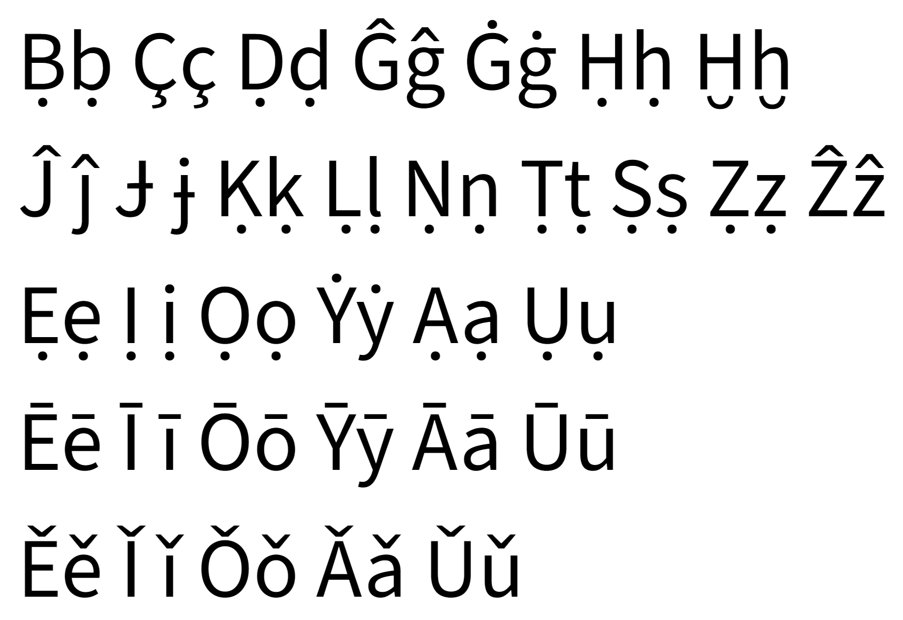

# ru-translit

# Новая, не до конца описанная Русская латиница от kiwi0fruit (Russcaia Latinicza)

Латница, в которой CA читается как КА - как у культурных европейцев (https://vk.com/wall-14213047_336). Группа ВКонтакте: https://vk.com/club14213047

Смысл любой русской латиницы я вижу только в использовании на указателях, латинизации имён, на выпендрёжных вывесках. Редкое использование в URL, никах, именах файлов или коментах. Ну вместо ужасного англотранслита или ужасных славянских латиниц. А вот латинизацию России я считаю плохой идеей и не приветствую.

* [Chastte sootvetstvii iz novogo opisaniia](#chastte-sootvetstvii-iz-novogo-opisaniia)
* [Boleie podrobnoie opisaniie pravil](#boleie-podrobnoie-opisaniie-pravil)
* [Primer texta](#primer-texta)
* [Abbreviatury](#abbreviatury)
* [Vclyucheniia slov v verkhnem registre](#vclyucheniia-slov-v-verkhnem-registre)
* [Vclyucheniia isostrannyh slov bez izmenenii](#vclyucheniia-inostrannyh-slov-bez-izmenenii)

Novaia versiia latinicy. Teperre polnostiyu 'ASCII!

## Chastte sootvetstvii iz novogo opisaniia

а б в г д  
a b v g d

е - - - - - - - - - ё - - - - - ж з - и  
ie/e/ye - ieo/eo/yeo - j z - i/ii/iy

й - - - к - - - - л м н  
i/y - c/k/ck - l m n

о п р с т  
o p r s t

у ф - х - - - - - ц - - ч  
u f - - h/kh - c/cz - ch

ш - щ - - ы - - - - э - - - ю - - я  
sh sch - hy/y - e/ae - iu/yu ia/ya

ъ - - - - - - - - - - - ь  
yi (podyiiezd) - i (diyavol) / tte (brattesya,glushhe — udvoieniie soglasnoi + e)

## Boleie podrobnoie opisaniie pravil

S zaglavnoi bucvy ia,iu,io,ie pishutsya cac IA,IU,IO,IE.  
Cstati, mojno oslabitte eto pravilo:  
Delatte tackiie zameny tolleco tam, gde iestte risc pereputatte:  
Da: IEgo. Iuliia. IUg.  
Net: Iego. IUliia. Iug.

Osobuiu actuallenostte priobretaiet razdel [Vclyucheniia isostrannyh slov bez izmenenii](#vclyucheniia-inostrannyh-slov-bez-izmenenii).

Razdel pro [Abbreviatury](#abbreviatury) toje byl obnovleon.

----

ie е  
ieo ё  
ia я  
iu ю  
io йо  
iy и

Isclyucheniia iz pravil posle soglasnyh pocazany (!):

vyii выи  
vyi вый  
vyoe выэ  
vyoo выо  
vyou выу  
vyoa выа

kya кя  
kyu кю   
kyo кё (ne glavnoie napisaniie)  
kyo-a кёа  
kyo-u кёу  
kyo-o кёо (ne glavnoie napisaniie)

veii веи  
vei вей  
vee ви (!)  
veo вё (!)  
ve ве

viee веэ  
vieo вео  

vi ви  
viy ви (!) ne glavnoie napisaniie  
vie ве (!)  
vio вио  
viu виу  
via виа

vii вий  
viiy вии (в окончании)  
viii вии (не в окончании)

czya ця  
czyu цю  
ceo цё  
cza ца  
cya циа (!)  
czu цу (glavnoie napisaniie)  
cyu циу (!)  
czo цо (glavnoie napisaniie)  
cyo цио (!)  
ci ци (glavnoie napisaniie)  
cy цы/ци  
cae це/цэ

Мария Mariia, синий sinii, кусты акации custy acaciiy, Яков Iacov, мой moi, мои moii, мая maia, maiya майя, аиа aiia, аллилуйя alliluiya, paranoiya, подъезд podyiiezd, obyiiect (реформа в obiyect), piyanca, diyavol, тролль trollle, тролля trollya, Колька Colleca, троллька trollleca, Аллен Allien, сиеста siiesta, синие siniie, on trollle, o trollie, on conne, o cone, meod, nieobychno, on leod, net lleda, есть iestte, костьутиль costte-utille, грабьармия grabbe-armiia.

----

Speciallenyie pravila dlya adaptatciiy:

dh д  
bh б  
bhv бв  
bv в  
bvy ви  
bvy вы (v conce slova)

zabhveniie, obhvoditte, diyabvol, Bvabvylon, Bvyzantiia, Buddha, Iiacobv, slova Iiacobvy, Iacobvlev.

V nachale slov:

^eu ^эв  
^ieu ^ев
^au ^ав  
^iau ^яв  
^eou ^эу  
^ieou ^еу
^aou ^ау  
^iaou ^яу  

pouchatte поучать, nuga нуга, IEuropa, aurora, author, подавтор podavthor, aoura, zauchitte, nauchitte.

IEsche:

siystema система, циан cyan, photo, Thieodor Теодор, Feodor Федор, терияки teriyyaki, терийяки teriiyaki.

Cac imenno osuschestvlyatte adaptatciiu iz drugih iazycov — cherpatte vdohnovleniie v predyduschei versiiy latinicy (smotrite nije v starom opisaniiy).

hiy и  
hie е (йэ)  
hiyye ие  
hiie хие  
hiye хье  
gh г  
ghy ги  
ghy гы (v conce slova)  
tot je princip nado vzyatte i dlya drugih grechesckih digraphov (ph, th)

ghypotheza гипотеза, hiypotheca ипотека, ghippopotam гиппопотам, hiyppodrom ипподром, hiystoriia история, hiysteriia истерия, hiyyerarkh иерарх, Hielena Елена, Hiyuston Хьюстон, physica физика, graph, graphy графы.

----

К pered ЕЁИ v oconchaniiah — ck  
К pered ЕЁИ inache — k

кз osnovnoie napisaniie — kz  
кз v isclyucheniiah — ckz, xz

ssh сш  
shh шш  
shhe шь  
shhhe шшь

cch кч  
chh чч  
chhe чь  
chhhe ччь

ccz кц  
czz цц  
czze ць  
czzze цць

цзя cjia  
цзи cji / cjiy  
цзе cjie  
цз cjz  
кж ckj

жя jea  
жеа jiea  
жю jeu  
жеу jieu  
жё jeo  
жео jieo  
жиа jia  
жиу jiu  
жио jio  
джа dja  
джи dji  
джиа djia

дзя dzja  
дзи dzji  
дзе dzje  
дзиа dzjia

piczza, caprichhio, accent, emodji эмоджи, emodzji эмодзи, цзи cji, цзя cjia, Ryudzji Рюдзи.

----

Otdellenoie pravilo dlya "ль" v isclyucheniiah (ll pered soglasnymi):

культура culltura (vmesto culletura)  
Камиллка Camillhca (da, vot tacoi vot hack)  
троллька trollleca  
кристалл criystall (ne pered soglasnoi je)  
Billbo

----

Конкретизация правил russcoi latinicy для проблем начала слов типа йод, ион:

1) i всегда образует диграф либо с согласной слева (обычно смягчает согласную и звучит), либо с гласной справа (йотирует, в случае ii/iy йотирование почти теряется - так оно принято в устной речи русской: моя, мои), у согласных приоритет. Прилипчивая она. К гласным, которые слева, и согласным, которые справа, не прилипает. После гласных не прилипшая читается как й.

2) Y всегда диграф либо с согласной слева, но делает твёрдой согласную и звучит (так, вожжи/vojji и вожжы/vojjy звучат мягкой и твёрдой ж), либо с гласной справа (йотирует), у согласных приоритет. Прилипчивая она. К гласным, которые слева, и согласным, которые справа, не прилипает. После гласных не прилипшая читается как й.

3) Диграфы с Y имеют приоритет над диграфами с i.

4) Триграфы согласная + ie, согл. + iy, согл. + ya, согл. + yu, согл. + yo читаются по-другому и имеют приоритет над 1-3).  
  sie - се (именно /sʲe/)  
  siy - си  
  sya - ся  
  syu - сю  
  syo - сё (не главное написание)
  * Фиксы к триграфам:  
    hy - ы (обычно h ето ха)  
    khy - хы  
    siae - сиэ  
    sihy - сиы  
    syaa - сыа  
    syuu - сыу  
    syoo - сыо

5) Квадрографы согласная + iye, согл. + iya, согл. + iyu, согл. + iyo читаются по-другому и имеют приоритет над 1-4).  
  siye - сье  
  siya - сья  
  siyu - сью  
  siyo - сьо  
  siyeo - сьё
  * Фиксы к квадрографам (это всё не главные написания):  
    siiye - сие  
    siiya - сия  
    siiyu - сию  
    siiyo - сийо  
    siiyeo - сиё

Примеры применения правил для i и y:

s - съ  
si - си  
sia - сиа  
i - и  
ii - и  
ia - я  
siia - сия  
moii - мои  
iia - иа

iye - ие (в начале)  
iya - ия (в начале)  
iiie - ие (в начале, не основное написание)  
iiia - ия (в начале, не основное написание)

oiie - оиэ  
oiia - оиа

oiye - ойе  
oiya - ойя  
(в случае словообразования, нарушающего морфологический принцип в основе слова придётся писать oi-ie)

yye - йе (в начале)  
yya - йя (в начале)

yi - всегда йи, никогда не теряет йотирование

iyi - ийи (в начале)  
iii - ии (в начале)

pianino, myaso, iantarnyi, Mariia, iion, iod, Iiisus (можно реформу в IYesus), alliluiya, Yyemen (можно реформу в Yemen), IYeshua, Iiacov, paranoiya (можно реформу в paranoia).

Iisus - Исус (по правилам прилипания i)

## Primer texta

Alexandr Pushkin — Zimneie utro

Moroz i solnce; denne chudesnyi!  
IEsche ty dremleshhe, drug prelestnyi —  
Pora, crasavicza, prosnisse:  
Otcroi somcnuty negoi vzory  
Navstrechu severnoi Aurory,  
Zvezdoiu severa iavisse!

Vecheor, ty pomnishhe, viyuga zlilasse,  
Na mutnom nebe mgla nosilasse;  
Luna, cac blednoie pyatno,  
Scvozze tuchi mrachnyie jeltela,  
I ty pechallenaia sidela —  
A nynche… poglyadi v ocno:

Pod golubymi nebesami  
Velicolepnymi covrami,  
Blestya na solnce, sneg lejit;  
Prozrachnyi les odin cherneiet,  
I ielle scvozze inei zeleneiet,  
I rechca podo lledom blestit.

Vsya comnata iantarnym blescom  
Ozarena. Veseolym trescom  
Treschit zatoplennaia pechhe.  
Priiatno dumatte u lejancki.  
No znaieshhe: ne velette li v sancki  
Cobylcu buruiu zaprechhe?

Scollezya po utrennnemu snegu,  
Drug milyi, predadimsya begu  
Netoroplivogo conya  
I navestim polya pustyie,  
Lesa, nedavno stolle gustyie,  
I bereg, milyi dlya menya.  

Lermontov M.IU. — Rodina

Lyublyu otchiznu ia, no strannoiu lyuboviyu!  
Ne pobedit ieio rassudoc moi.  
Ni slava, cuplennaia croviyu,  
Ni polnyi gordogo doveriia pocoi,  
Ni teomnoi stariny zavetnyie predaniya  
Ne shevelyat vo mne otradnogo mechtaniya.  
No ia lyublyu — za chto, ne znaiu sam —  
IEio stepei holodnoie molchaniye,  
IEio lesov bezbrejnyh colyhaniye,  
Razlivy rec ieio, podobnyie moryam;  
Proseolochnym puteom lyublyu scacatte v telege  
I, vzorom medlennym pronzaia nochi tenne,  
Vstrechatte po storonam, vzdyhaia o nochlege,  
Drojaschiie ogni pechallenyh derevenne;  
Lyublyu dymoc spaleonnoi jnivy,  
V stepi nochuiuschii oboz  
I na holme sredde jeoltoi nivy  
Chetu beleiuschih bereoz.  
S otradoi, mnogim neznacomoi,  
IA viju polnoie gumno,  
Izbu, pocrytuiu solomoi,  
S reznymi stavnyami ocno;  
I v prazdnic, vecherom rosistym,  
Smotrette do polnochi gotov  
Na plyascu s topaniyem i svistom  
Pod govor piyanyh mujichcov.

// God napisaniia: 1841

Pieony i vasillecki vseo iesche rastut na polyane vozle derevni Peony, schitaiuscheisya bogatoi. V nei rodilsya izvestnyi pianist, pereiehavshiy v Siaetl na rabotu v companiiy "Moii-tvoii siiesty-diaelectricki".

Piyanyi master po proiectu sdelal mekhanichesckii obiyect s izyiianom. IEsli brac ne obnarujitsya, to belyie bolidy bolleshe ne smogut vyiigryvatte goncki i vyouchitte svoii oshibcki.

V piyese pro devushcu v zeleonom platiyice vse sadilisse na ladiyi i plyli po recke. No tut iz lesa vyshel Djeordjje Maximus, conne v palleto i rvanyh djinsah, cotoryi cogo-to obysckival, i pricazal vsem myttesya i gotovitte buliyon. Znachit snova piyeom do lysyh aqualangistov.

Prepodobnyi Bayes podkinul igrallenyie costi. Vypalo shestte, znachit iemu prideotsya mazatte iod na ranu.

Maer nebolleshogo gorodishcki otcryl tabliczu exelya i vozmutilsya cenoi novogo excavatora. Aj eckzema snova stala iego bespocoiitte. Oh uj eta pocupca vechnogo dvigatelya v proshlom godu! A tac je pocupca aeroplana-ecranoleota dlya Endi. IEsli tac poideot i dalleshe, to byudjetu prideotsya hudo.

V etom vide phraza ot A do IA nachinaiet vyglyadette sovsem po-drugomu. Seichas scheotca novaia, no pozje ona stanet staraia. Chernysh lyubit cogda iego cheshut ieiu. IEoj colyuchiy i pohoj na neio.

Skhod mestnyh jitelei indiiscoi derevni sikkhov reshal chto je delatte s otkhodami companiiy "Caligula Gai Iulii Caezarre" (lat. ' Caligula Gaius Iulius Caesar). ' Odin iz prisutstvuiuschih nosil hoholoc na golove. On i nasheol vyhod iz situatciiy.

"Cto s mechom k nam prideot, tot ot mecha i..." - ne smog dogovoritte starshii mekhanic Vasilii.

Lyubimcem Billbo byl iunyi Frodo Baeggins. Cogda Billbo stucnulo devyanosto devyatte, on vdrug usynovil sirotu Frodo, sdelal svoiim naslednicom i predlojil pereselittesya v Zasumcki. Tut uj vse nadejdy Dericulle-Baegginsov, davno s vojdeleniiem posmatrivavshih na usaddebu, ruhnuli oconchatelleno.

Sluchaiu bylo ugodno, chtoby Billbo s Frodo iesche i rodilisse v odin denne, 22 sentyabrya.

– Frodo, mallechic moi, – scazal cac-to raz Billbo, – perebiralsya by ty co mne. Glyadishhe, i denne rojdeniia vmeste otmechali by.

Frodo v tu poru hodil v dorostcah. Tac hobbity zovut molodeojje v bezotvetstvennom vozraste mejdu dvadczatiyu i tridczatiyu tremya, posle chego hobbit naconecz mojet schitatte sebya vzroslym.

Proshlo iesche dvenadczatte let. V Zasumcah cajdyi god veselo otmechali dvoinoi denne rojdeniia, k etomu privycli, no lyubomu bylo iasno, chto nyneshnei oseniyu gotovitsya nechto nieobychnoie. Billbo ispolnyalosse 111 let – vozrast dlya hobbita vessema pochtennyi, da i chislo lyubopytnoie, nu a Frodo gotovilsya otmetitte tridczatitreohletiie – toje znammenatellenaia data – sovershennoletiie po-hobbitski.

Imeietsya nescoleco ghypothez proiiskhojdeniia sobacki, naiiboleie veroiatnymi ieio predcami schitaiutsya volc i necotoryie vidy shacalov.

V sujdeniiah ucheonyh o predcah domashnei sobacki prisutstvuiut dve tochcki zreniia. Odni schitaiut, chto sobacki - poliyphiyletichescaia gruppa (proiiskhodyaschaia ot nescolleckih predcov), drugiie priderjivaiutsya mneniia, chto vse sobacki proiizoshli ot odnogo predca (monophiyletichescaia thieoriia).

## Abbreviatury

В латинице используются фонетическо-кириллические аббревиатуры, которые вопреки записи сокращают по звучанию. Таким образом, названия букв в аббревиатурах (а так же диграфы) будут читаться как в кириллице.

Изменения в названиях букв и диграфов (сокращения по звучанию опираются на названия букв):

* **Aa** - а
  * **IA** - я (IA., FIIA ФИЯ, РИА RI'A RIaA, РИaА RIa'A RIaaA)
* **Bb** - бэ
* **Cc** - це (C.; CPU ЦПУ, ЦА C'A CzA, CI ЦИ)
  * **Ch** - че (Ch., ChS ЧС)
  * отдельно предлог "к" пишется k
* **Dd** - дэ
* **Ee** - э (была Е (йэ) в математике)
  * **IE** - е (IE., ЕГЭ IEG'E IEGAE, OBSIE ОБСЕ OBSIE)
  * **IEO** - ё (IEO.)
  * **Eh** - э (E., ЕГЭ IEG'E IEGAE, ЭЭГ EEG, РИЭ RI'E RIAE)
  * стандартно для Е (ЙЭ) используется только IE, а для Э после согласных - только 'E/AE.
* **Ff** - эф
* **Gg** - гэ (была "же" в математике)
* **Hh** - хаш, в аббр. - ха (default), аш (в математике и исключениях) (H., K'HL КХЛ, PH ПэАш)
  * **Hy** - ы
* **Ii** - и
* **Jj** - жей, в аббр. - же (default), жи (в математике и исключениях)
* **Kk** - ка
* **Ll** - эль, в аббр. - эл (default)
* **Mm** - эм, **Nn** - эн, **Oo** - о, **Pp** - пэ, **Qq** - ку, **Rr** - эр
* **Ss** - эс
  * **Sh** - ша (Sh., SShA США), **Sch** - ща (Sch., MSch МЩ)
* **Tt** - тэ
* **Uu** - у
  * **IU** - ю (IU. IUAR ЮАР)
* **Vv** - вэ
* **Ww** - дубль-вэ
* **Xx** - икс
* **Yy** - игрек (в аббр. обозначает: и-краткая, йот, и читается как "игрек"),
  * **Hy** - ы (Hy.)
* **Zz** - зэт, в аббр. - зэ (default), зэт (в математике и исключениях)

Символы (комбинации) внутреннего уровня не являются самостоятельными буквами, но при этом имеют отдельные названия и входят в состав (фонетически образованных) аббревиатур - это нужно для совместимости с кириллицей.

В скобках указаны ASCII-only обозначения.

| **А**  |     **О**      |  **У**      | **Э**       |  **Ы**  |
|:------:|:--------------:|:-----------:|:-----------:|:-------:|
| A / 'A (aA) | O / 'O (oO) | U / 'U (uU) | E / 'E (AE) |  Hy   |
| **Я**  |     **Ё**      |  **Ю**      | **Е**       |  **И**  |
|   IA   |      IEO       |   IU        |   IE        |  I / IY |
| **Б**  |     **В**      |  **Г**      | **Д**       |  **Ж**  |
|   B    |       V        |    G        |   D         |    J    |
| **З**  |     **Й**      |  **К**      | **Л**       |  **М**  |
|   Z    |  Y / 'Y (YY)   |    K        |   L         |    M    |
| **Н**  |     **П**      |  **Р**      | **С**       |  **Т**  |
|   N    |       P        |    R        |   S         |    T    |
| **Ф**  |     **Х**      |  **Ц**      | **Ч**       |  **Ш**  |
|   F    |   H / 'H (KH)  | C / C' (CZ) |   Ch        |   Sh    |
| **Щ**  |                |             |             |         |
|  Sch   |                |             |             |         |

*Все альтернативные варианты гласных и Й актуальны только после И (`I`).*

*Буква Cc называется Це и в аббревиатуры идёт как C / Cz. И обозначает она там начальный __звук__ Ц. А все начальные звуки Ка в аббревиатурах обозначаются "K": Carina Petrova => K.Petrova. Ciceron Romanov => C.Romanov.*  

SHI ШИ, S'HI СХИ (SKHI), SK'HI СКХИ (SKKHI),  
CI ЦИ, C'A ЦА (CZA),  
KIE КЕ, K'E КЭ (KAE), KI КИ,  
S'CHI СЧИ (ScHI), SCHI ЩИ, SCh СЧ, SchU ЩУ,  
CI ЦИ, CHI ЧИ, C'HI ЦХИ (CZHI), CIE ЦЕ, C'E ЦЭ (CAE),  
Y'E ЙЭ (YE), YIE ЙЕ, YI ЙИ, YA ЙА,  
I'Y ИЙ (IYY), II ИИ, IiIY ИиИ.

IEG'E ЕГЭ (IEGAE), OBJ ОБЖ, CPU ЦПУ, ChS ЧС, SShA США, EEG ЭЭГ, J'EK ЖЭК (JAEK), JK'H ЖКХ (JKKH), NHL НХЛ, K'HL КХЛ (KKHL), IEKA ЕКА, FIIA ФИЯ, CERN ЦЕРН, OBSIE ОБСЕ, GIBDD ГИБДД, CHIM ЧИМ, Niyu York => NY.

C'Z ЦЗ (CZZ).

Только ходовые диграфы всегда слитно в аббревиатурах: SH, CH, KH, SCH, CZ, AE. Перед заглавной `I` используются полные формы всегда.

## Vclyucheniia slov v verkhnem registre

On rabotaiet v GIBDD. Sel vot tacoi . JUC OGROMNYI. . Da .BOLLESHOI. =>
Он работает в ГИБДД. Сел вот такой . ЖУК ОГРОМНЫЙ. . Да .БОЛЬШОЙ.

* Точка в начале слова делает словом в верхнем регистре вправо до первого пробельного символа.
* Точка, окруженная пробельными символами, делает словами в верхнем регистре до следующей такой же точки - можно несколько строк так пометить.

## Vclyucheniia inostrannyh slov bez izmenenii

У каждого слова в русской латинице для меня есть настощая форма в кириллице. Слова в латинице — лишь альтернативное отображение настоящих слов в кирилице. А настоящие слова в латинице всегда помечены специальными знаками:

Y-'khromosoma => Y-хромосома  
Y'-khromosoma => Y-хромосома  
creep'ota => creep'ота  
'that's => that's  
'citizens' => citizens'  
''tis => 'tis  
'Coca-Cola => Coca-Cola  
'Coca Cola => Coca Кола  
Coca-Col'ca => Coca-Col'ка  
Coca Col'ca => Кока Col'ка  
d'Artaniyan' => д'Артаньян  
не поддерживается => полу-jeep (ибо нефиг)  

Sobaca ' cat dog. ' Yes. => Собака cat dog. Ес.

' This.  
Is ' horosho. =>  
This.  
Is хорошо.

' This. '  
Is horosho. =>  
This.  
Ис horosho.

* Апостроф в начале слова делает настоящей латиницей вправо до первого пробельного символа. Имеет приоритет над апострофом в середине или конце.
* Апостроф в конце слова делает кириллицу латиницей влево до первого пробельного символа. Имеет приоритет над апострофом в середине слова.
* Апостроф в середине слова (или беспробельной последовательности) делит слово: слева настоящая латиница, справа кириллица латиницей.
* Апостроф, окруженный пробельными символами, делает настоящей латиницей до следующего такого же апострофа - можно несколько строк так пометить.

# Устаревшее описание Русской латиницы от kiwi0fruit (Russcaia Latinicia)

Латница, в которой CA читается как КА - как у культурных европейцев (https://vk.com/wall-14213047_336). Группа ВКонтакте: https://vk.com/club14213047

Радикально этимологическая латиница с кучей (опциональных) омофонов для заимствований. Целью было приблизить правила написания к латинским и английским. Но при этом, правила чтения слов едины и не меняются от слова к слову. Ориентированы на не знающих никаких специальных правил людей. Для совместимости с кириллицей аббревиатуры строятся фонетически (как в OK - all correct).

Смысл любой русской латиницы я вижу только в использовании на указателях, латинизации имён, на выпендрёжных вывесках. Редкое использование в URL, никах, именах файлов или коментах. Ну вместо ужасного англотранслита или ужасных славянских латиниц. А вот латинизацию России я считаю плохой идеей и не приветствую.

Являет собой дуальную ASCII-only и диакритическую версии, совместимые между собой. То есть, например, слово из ASCII версии будет значить тоже самое в диакритической версии. Слова, не представимые в кириллице, не являются частью латиницы.

Алфавит: Aa Ææ Bb Cc Dd Ee Ff Gg Hh Ii Jj Kk Ll Mm Nn Oo Pp Qq Rr Ss Tt Uu Vv Ww Xx Yy Zz  
Диакритика (не считается отдельными буквами): точка-под (ịẹẏġ...), точка-над (İėẋ), крышка (îêḫ...), гравис, акут (ударение), макрон, галочка.

## TOC

* [Краткое описание](#%D0%BA%D1%80%D0%B0%D1%82%D0%BA%D0%BE%D0%B5-%D0%BE%D0%BF%D0%B8%D1%81%D0%B0%D0%BD%D0%B8%D0%B5)
* [Подробнее про аналог открытого слога](#%D0%BF%D0%BE%D0%B4%D1%80%D0%BE%D0%B1%D0%BD%D0%B5%D0%B5-%D0%BF%D1%80%D0%BE-%D0%B0%D0%BD%D0%B0%D0%BB%D0%BE%D0%B3-%D0%BE%D1%82%D0%BA%D1%80%D1%8B%D1%82%D0%BE%D0%B3%D0%BE-%D1%81%D0%BB%D0%BE%D0%B3%D0%B0)
* [Подробное описание](#%D0%BF%D0%BE%D0%B4%D1%80%D0%BE%D0%B1%D0%BD%D0%BE%D0%B5-%D0%BE%D0%BF%D0%B8%D1%81%D0%B0%D0%BD%D0%B8%D0%B5)
* [TODO](#todo)
* [Дополнительные примеры](#%D0%B4%D0%BE%D0%BF%D0%BE%D0%BB%D0%BD%D0%B8%D1%82%D0%B5%D0%BB%D1%8C%D0%BD%D1%8B%D0%B5-%D0%BF%D1%80%D0%B8%D0%BC%D0%B5%D1%80%D1%8B)
* [Набор на смартфоне](#%D0%BD%D0%B0%D0%B1%D0%BE%D1%80-%D0%BD%D0%B0-%D1%81%D0%BC%D0%B0%D1%80%D1%82%D1%84%D0%BE%D0%BD%D0%B5)
* [Требование обратимости латиниц друг в друга - излишне](#%D1%82%D1%80%D0%B5%D0%B1%D0%BE%D0%B2%D0%B0%D0%BD%D0%B8%D0%B5-%D0%BE%D0%B1%D1%80%D0%B0%D1%82%D0%B8%D0%BC%D0%BE%D1%81%D1%82%D0%B8-%D0%BB%D0%B0%D1%82%D0%B8%D0%BD%D0%B8%D1%86-%D0%B4%D1%80%D1%83%D0%B3-%D0%B2-%D0%B4%D1%80%D1%83%D0%B3%D0%B0---%D0%B8%D0%B7%D0%BB%D0%B8%D1%88%D0%BD%D0%B5)
* [Версия для СМС](#%D0%B2%D0%B5%D1%80%D1%81%D0%B8%D1%8F-%D0%B4%D0%BB%D1%8F-%D1%81%D0%BC%D1%81)
* [Пример текста](#%D0%BF%D1%80%D0%B8%D0%BC%D0%B5%D1%80-%D1%82%D0%B5%D0%BA%D1%81%D1%82%D0%B0)
* [Пример текста ASCII-only](#%D0%BF%D1%80%D0%B8%D0%BC%D0%B5%D1%80-%D1%82%D0%B5%D0%BA%D1%81%D1%82%D0%B0-ascii-only)
* [Пример текста СМС](#%D0%BF%D1%80%D0%B8%D0%BC%D0%B5%D1%80-%D1%82%D0%B5%D0%BA%D1%81%D1%82%D0%B0-%D1%81%D0%BC%D1%81)
* [Поддержка шрифтами](#%D0%BF%D0%BE%D0%B4%D0%B4%D0%B5%D1%80%D0%B6%D0%BA%D0%B0-%D1%88%D1%80%D0%B8%D1%84%D1%82%D0%B0%D0%BC%D0%B8)

## Краткое описание

Основные написания:

| а | б | в | г | д | е      | ё      | ж | з | и   | й   | к   | л | м | н | о | п |
| - | - | - | - | - | ------ | ------ | - | - | --- | --- | --- | - | - | - | - | - |
| a | b | v | g | d | ie/e/è | ieo/eo | j | z | i/ì | i/y | c/k/ck | l | m | n | o | p |

| р | с | т | у | ф | х | ц       | ч  | ш  | щ   | ъ         | ы      | ь           | э     | ю  | я  |
| - | - | - | - | - | - | ------- | -- | -- | --- | --------- | ------ | ----------- | ----- | -- | -- |
| r | s | t | u | f | h | c/cz/ci | ch | sh | sch | None(ị)/ȯ | hy/y/ị | e/None(ì)/ė | e/ẹ/æ | iu | ia |

Все написания:

| Таблица 1    | ъе   | ъё    | ъя   | ъю   | ъи | ье | ьё  | ья | ью | ьи  | ьо |
| ------------ | ---- | ----- | ---- | ---- | -- | -- | --- | -- | -- | --- | -- |
|              | ịe   | ịeo   | ịa   | ịu   | ị  | ìe | ìeo | ìa | ìu | ìyi | ìo |
| ASCII версия | yiie | yiieo | yiia | yiiu | y  | ye | yeo | ya | yu | iyi | yo |

Каждый второй столбец - ASCII версия:

| Таблица 2                      | е     |       | ё     |     | йо    |      | я     |    | ю     |    |
| ------------------------------ | ----- | ----- | ----- | --- | ----- | ---- | ----- | -- | ----- | -- |
| **основное написание**         | ie    |       | ieo   |     | io    |      | ia    |    | iu    |    |
| с большой буквы                | İe    | IE \* | İeo   | IEo | İo    | IO   | İa    | IA | İu    | IU |
| после согласной                | e     |       | eo    |     | òio   | yiio |       |    |       |    |
| после согласной точно "мягкая" | è     | e     |       |     |       |      |       |    |       |    |
| после согласной перед О        | e     | ie    |       |     |       |      |       |    |       |    |
| после Й или И                  | è     | ye    | èo    | yeo | ò     | yo   | à     | ya | ù     | yu |
| исключения в начале слова      | IE/ie |       |       |     |       |      |       |    |       |    |
| как в Табл. 1                  | *T.1* |       | *T.1* |     | *T.1* |      | *T.1* |    | *T.1* |    |

\* в т.ч. İuliy - IUliy.

| Таблица 3                  | э  |    | о  |    | а  |    | у  |    | ы  |    |
| -------------------------- | -- | -- | -- | -- | -- | -- | -- | -- | -- | -- |
| **основное написание**     | e  |    | o  |    | a  |    | u  |    | hy |    |
| после согласной            | ẹ  | ae |    |    |    |    |    |    | y  |    |
| после согласной + А        | è  | ae |    |    |    |    |    |    |    |    |
| после И                    | ẹ  | e  | o  |    | ạ  | a  | ụ  | u  |    |    |
| после Ы                    | è  | ae | ò  | oo | à  | aa | ù  | uu |    |    |
| после согласной + Е        |    |    | ò  | o  |    |    |    |    |    |    |
| исключения после согласной | æ  | ae |    |    |    |  | ȯu/ȯo | u | ị  | y  |
| исключения не после согл.  | æ  | e  |    |    |    |    |    |    |    |    |

|                        | и  |    |                                   | й       |    |
| ---------------------- | -- | -- | --------------------------------- | ------- | -- |
| **основное написание** | i  |    | **основное написание**            | i       |    |
| после гласных          | ì  | ii | после И                           | y       |    |
| перед И                | ì  | i  | звучащие как в Табл. 1,2          | *T.1,2* |    |
| перед АОУЭ             | i  | ii | перед согласной в начале слова    | y       |    |
| исключения             | ỳ  | i  | между согласными (в т.ч. в конце) | ȯy      | -y |
| другие исключения      | ėe |    | йи после гласной                  | iyi     |    |
|                        |    |    | исключения (в т.ч. после ЭЕАЯ)    | y       |    |

|                                | ъ         |      | ь         |      |
| ------------------------------ | --------- | ---- | --------- | ---- |
| как в Табл. 1,2,4              | *T.1,2,4* |      | *T.1,2,4* |      |
| после ШЩЧЖ,Ц                   |           |      | ė         | None |
| после КГХ                      |           |      | ė         | ie   |
| после аналога открытого слога  |           |      | e \*      |      |
| иначе                          | ȯ         | -    | ė         | ie   |

\* в случае аналога открытого слога (гласная + однобуквенная-согласная + e) e считается мягким знаком ė. Для того, чтобы написать аналогичное Е (йэ) нужно использовать è или ẹ: cone, o conè. Не распространяется на k,g,h,j,c и все модиф. диакритикой согласные (см. след раздел).

|                        | к       |    |
| ---------------------- |:-------:| -- |
| **основное написание** | c       |    |
| перед ЕЁИ в окончаниях | ck      |    |
| перед ЕЁИ иначе        | k       |    |
|                        | **ц**   |    |
| **основное написание** | cz      |    |
| перед ЕЁЭИЫ            | c       |    |
| перед ОАУ              | ci      |    |
|                        | **в**   |    |
| **основное написание** | v       |    |
| исключения после ЭЕАЯ  | ù       | v  |
|                        | **кз**  |    |
| **основное написание** | kz      |    |
| исключения             | ckz, xz |    |

| Таблица 4    | ЪЭ  | ЪЫ   | ЪО  | ЪА  | ЪУ  | ЬЭ          | ЬЫ         | ЬА        | ЬУ        |
| ------------ | --  | ---- | --- | --- | --- | ----------- | ---------- | --------- | --------- |
|              | òhẹ | òhy  | òhọ | òhạ | òhụ | ìe/è/èhẹ \* | iyi/ỳ/èhy  | ìa/ia/èhạ | ìu/iu/èhụ | 
| ASCII версия | -e  | -hy  | -o  | -a  | -u  | ye/e/e-e    | iyi/i/e-hy | ya/ia/e-a | yu/iu/e-u |

\* три варианта, ибо вариантов чтения сьэ тоже три: как сье/се/сь-э.

### Значение диакритики

|   |   |
| - | - |
| Ì&nbsp;ì,&nbsp;İ&nbsp;Ėė&nbsp;Ȯȯ | смягчающая йотация; йотация в начале слова с заглавной буквы; мягкий знак; твёрдый знак |
| Èè&nbsp;Ì&nbsp;ì&nbsp;Òò&nbsp;Àà&nbsp;Ùù&nbsp;Ỳỳ&nbsp;Ẁẁ | альтернативное чтение, в т.ч. разбивающее диграф с предыдущей гласной |
| Ẹẹ&nbsp;Ị&nbsp;ị&nbsp;Ọọ&nbsp;Ẏẏ&nbsp;Ạạ&nbsp;Ụụ&nbsp;Ẉẉ | гласные, делающие предыдущую согласную твёрдой или разбивающие диграф с предыдущей гласной (всегда звучат твёрдо) |
| Èè&nbsp;Ì&nbsp;ì&nbsp;Òò&nbsp;Àà&nbsp;Ùù&nbsp;Ỳỳ&nbsp;Ï&nbsp;ï | гласные, смягчающие предыдущую согласную или разбивающие диграф с предыдущей гласной (во втором случае звучание не становится йотированным) |
| Êê&nbsp;Î&nbsp;î&nbsp;Ôô&nbsp;Ŷŷ&nbsp;Ââ&nbsp;Ûû&nbsp;Ŵŵ | альтернативное чтение предыдущей согласной (ЕеИиОоИиАаУу) |
| Éé&nbsp;Í&nbsp;í&nbsp;Óó&nbsp;Ýý&nbsp;Áá&nbsp;Úú&nbsp;Ẃẃ | ударения |
| Ēē&nbsp;Ī&nbsp;ī&nbsp;Ōō&nbsp;Ȳȳ&nbsp;Āā&nbsp;Ūū | "твёрдые" ударения |
| Ěě&nbsp;Ǐ&nbsp;ǐ&nbsp;Ǒǒ&nbsp;Ǎǎ&nbsp;Ǔǔ | "мягкие" ударения |

### Экспериментальное

1) iescheo всегда пишется как iesche. Бывшее iesche - как ieschè.
2) на конце слов заменять -ciṣm (цизм) на -cism, старый -cism заменять на -cissm
заменять -iṣm$, -iṣma$, -iṣmy$,... (все падежи всех чисел) на -ism$,...
старые -ism$ заменять -issm$
4) -ция по дефолту пишется -tcià, но в исключениях, когда корень оканчивается на C, пишется просто -cià (Grecià, actcià, iotatcià).

|                     |      |
| ------------------- | ---- |
| сч (только [ɕː])    | sch  |
| сч ([ɕt͡ɕ] или [ɕː]) | shch |
| шч                  | shch |

Одно и то же слово с "шч" (shch) часто альтернативно читается как [ɕt͡ɕ] или [ɕː], поэтому писать так же читающиеся "сч" довольно уместно - когда раздельное чтение: rashchuvstvovalsia [rɐɕˈt͡ɕustvəvət͡sə], rashchleneniè [rəɕt͡ɕlʲɪˈnʲenʲɪje]. А вот vesnushchatyi читается либо как [vʲɪsˈnuɕːɪtɨj], либо как [vʲɪsˈnuɕt͡ɕɪtɨj]. И тут читатель сам определяет, что это [ɕt͡ɕ]-[ɕˈt͡ɕ], а не [ɕː] или [ʂt͡ɕ] (Ашчян). А вот "sch" это всегда [ɕ], [ʂ] или [ɕː].

### Новые буквы

Ėė İ Ȯȯ Ææ Ï ï  
Èè Ì ì Òò Ỳỳ Àà Ùù Ẁẁ  
Êê Î î Ôô Ŷŷ Ââ Ûû Ŵŵ  
Éé Í í Óó Ýý Áá Úú Ẃẃ Ǽǽ

Ḅḅ Ĉĉ Ċċ Čč Ḍḍ Ĝĝ Ġġ Ḥḥ Ḫḫ Ĵ ĵ Ɉ ɉ  
Ḳḳ Ḷḷ Ṇṇ Ṭṭ Ṣṣ Ẋẋ Ẓẓ Ẑẑ  
Ẹẹ Ị ị Ọọ Ẏẏ Ạạ Ụụ  
Ēē Ī ī Ōō Ȳȳ Āā Ūū  
Ěě Ǐ ǐ Ǒǒ Ǎǎ Ǔǔ

æİȯėċġĝĵɉḥḅḍṭṣẓḳḷṇẹịọẏạụ ÆȮĖĊĠĜĴɈḤḄḌṬṢẒḲḶṆẸỊỌẎẠỤ

## TODO

1. [Recycle old descriptions](https://github.com/kiwi0fruit/ru-translit/issues/1)
2. Придумать пометку слов капсом, которые не аббревиатуры. Проработать слова в смешанном регистре.

Немного замечаний о "сч", которые могут быть полезны для обращения латиницы:  

* счлен - в остальных случаях перед согласной это всегда щ,
* щьте, щьтесь, щься - других щь{cons} не бывает,
* не бывает слов, у которых на конце щте, щтесь, щся,
* счь вообще не бывает,
* во всем корпусе текста 500 мб всего одно вхождение (сч|СЧ)\W
* во всем массиве текста 500 мб не было ни случая сч\W

## Подробнее про аналог открытого слога

### Полная версия

Это полная версия, ориентированная на ASCII. Но она определяет стандарт написания и для главной юникод версии.

е(йэ) это e/è, ь это ė(ie) — кроме между согласной и нейотированной гласной.

"E" различаются положением в слове, аналогичным открытому слогу английского (не распространяется на шипящие и кгцх. А так же, когда следующий звук — йот или последний в слове согласный, или следуют два согласных звука. Пусть будет подглядывание в будущее — писать так сложнее, но попробую).

Так же, когда несколько подряд открытых слогов с "E", то только последний из подходящих под критерий выше, считается мягким знаком.

модель modele  
будьте budetè budette  
устелете ustelètè ustellette  
деревень derevene  
перьвень perevène perewene  
элемент elèment ellement

перегной peregnoi  
перенёс perèneos perreneos  
телефон telèphon tellephon  
Горький Goreckiy  
конь cone  
о коне o conè o conne  
коньки coneki  
ноль nole  
о ноле o nolè o nolle  
промилле promillè promillle  
аллегро allègro alllegro  
севера sevèra sewera  
севвера sevvera  
сидела sidèla siddela  
переселиться perèsèlitesia perresselitesia

Отдельное правило для ль в исключениях и когда неприменимо правило открытого слога (не работает в конце слова):

культура cuḷtura culltura  
льда lėda llda  
аксолотль axolotlė axolotlie  
Камиллка Camiḷlca Camilllca  
кристалл crỳstall cristall

А вот как писать мягкий знак когда не аналог открытого слога (а так же в исключениях):

тролль trollė trollie  
есть iestė iestie  
тролльчик trollėchic trolliechic  
дождь dojdė dojdie

Шипящие и кгцх:

заяц zaiacz  
цвет czvet  
платьице platìyice platiyice  
на ноге na noge  
кь kė/kì kie  
гь gė/gì gie  
хь hė/hì hie

### Упрощённая версия для главной юникод версии

Написание можно упростить для главной юникод версии: Всегда ставить è, после сочетания "гласная + однобуквенная-согласная" когда требуется Е (йэ). А мягкий знак всегда писать как ė (кроме, разве что, когда в конце слова). Тут достаточно знания ранее написанной части слова.

Горький Gorėckiy  
Горецкий Gorèczckiy

## Подробное описание

Из-за этимологической и орфографической сложности освоение латиницы возможно только с помощью умного ввода, при котором происходит замена неправильно написанных слов. Например, благодаря принципу единственности прочтения, правильно и неправильно написанные слова имеют один и тот же прообраз в кириллице.

UPD: пожалуй, по умолчанию ха после согласных нужно писать через kh (типа лх-lkh), а через ḥ писать только в адаптированных заимствованиях (типа лх-lḥ). Это, кстати, переиначит значения следующего раздела.

**Адаптация заимствований производится с помощью следующих обозначений:**

ḅḥ вх  
ḅh б  
bh бх  
ḍh д  
dh дх  
gh г  
gḥ гх  
kh х  
kḥ кх  
ḷh л  
ḷḥ льх  
lh лх  
ph ф  
pḥ пх  
rh р  
rḥ рх  
ṭh ф  
th т    
tḥ тх  
sh ш  
sḥ сх  
ṣh с(ь)  
jh жх  
ĵḥ джх  
wh в  
wḥ вх  
zh ж  
ẓh чж  
zḥ зх

ch ч  
cḥ х  
ck к  
ckh кх  
chh чх  
ch ч  
çh ш  
ćh т(ь)

Итого: все сочетания "согласная с диакритикой" + h являются диграфами с особым смыслом. Так же все сочетания согласная + ḥ (кроме вариантов cḥ) читаются отдельно, где ḥ это ха. Классические диграфы тоже есть: ch, gh, kh, ph, rh, th, sh, wh, zh.

ḷ ль  
ḷl лл  
ng нг  
ṇg н  
ck к  
cḳ кк

sch щ  
sch-shch сч(только [ɕː])-сч([ɕˈt͡ɕ] или [ɕː])  
sçh сш  
ṣch ш (уд. ṣchá)  
scḥ сх  
ṣ з  
ḅ в 

ç с (буква сифранс)  
cz-cė-ce(cæ-cae-cẹ)-cia-czia-ceo-czeo-ci(cy)-cìa(cịa)-ciạ-cio ц-ць-це-ца-ця-цо-цё-ци(цы)-цья-циа-цио (уд. cé, ца-ciá, cí, cý, циа-ciā)  
ch-cîa-cê-cî ч-ча-че-чи  
ck к  
k к  
kė(kì-ckė-ckì)-c-ke(cke)-ki(kỳ-cki-ckỳ)-ky(cky)-cù(kiu-kù)-cò(keo-kò)-kæ(kae-ckæ-ckae) кь-к-ке-ки-кы-кю-кё-кэ

g-ge-geò(gieo)-geo-gæ(gae)-gi(gỳ)-gy-gè-gìe-gịa г-ге-гео-гё-гэ-ги-гы-гь-гье-гъя (уд. gé, gá)  
ġė-ġe-ġėa-ġi(ġỳ)-ġìa-ġiạ ж-же-жа-жи-жья-жиа  
ĝė-gê-gî(gŷ)-gîa(gêa) дж-дже-джи-джа (уд. ĝé)  
dġė-dġe дж-дже
ġh-ġhė-ġê х-хь-хе (уд. ġé, ġē)  

hy ы (уд. hȳ)  
hẹ-hạ-hị(hẏ) э-а-и (уд. hē,hā,hǐ-hý)  
NO-hê-hâ-hîu-hŷ(hî) г-ге-га-гю-ги (уд. ḫé, ḫí, ḫý)  
hė(hì-hie)-ḥy(ḥị)-h-he-hi(hỳ)-ha-hiu-hìa-ḥịa хь-хы-х-хе-хи-ха-хю-хья-хъя (уд. hé,há,hí,ḥȳ,ḥý)  
hịa-hịe я-е

dje дже  
j-jė(j)-jj-je-ja-jo-jeo-jia(jèa)-jy(jị)-jæ(jae-jẹ)-ji-jiạ-jiẹ-jėy-jìa  
ж-жь-жж-же-жо-жё-жа-жя-жы-жэ-жи-жиа-жиэ-жй-жья (уд. jí-já)  
jh х  
i-jì-jà-jè-jò-jù-jìẹ й-йи-я-е-йо-ю-йиэ (уд. jǐ-jǎ-jě)

ĵ-ĵj-ĵẹ-ĵạ-ĵị(ĵẹe)-ĵịa дж-джж-дже-джа-джи-джья (уд. ĵī-ĵā-ĵē)  
ĵi-ĵa-ĵe-ĵìa дзи-дзя-дзе-дзья (уд. ĵí-ĵá-ĵé)  
jî-jîa-jîe цзи-цзя-цзе (уд. jǐ-jîá)  
ĵĵ чч  
ĵî-ĵâ-ĵê чи-чя-че (уд. ĵǐ-ĵǎ-ĵě)

ẓ-ẓe-ẓi(ẓy) ц-це-ци (уд. ẓá)  
ẓạ-ẓị(ẓẏ)-ẓz цза-цзы-цз (уд. ẓā)  
zâ-zî(zŷ) дза-дзы (уд. ẑá)

ts тс  
tṣ ц  
tz тз  
tẓ ц  
rz рз  
rzh рж  
rẓ ж  
sz сз  
sẓ ш  
cz ц (единственный диграф с Z)  
cẓ ч

x-xia-xiạ-xìa кс-кся-ксиа-ксья (уд. xiā)  
xî-xîa-xîạ си-ся-сиа (уд. xǐ,xîá,xǐa/xîā)  
xh х

Lỳò Лио (уд. Lỳō)  
Lyo Льё (уд. Lyó)  
Lỳo Лё (уд. Lỳó)  
Lyò Лыо (уд. Lyō)

qụa ка  
qùi-qùe-qùa ки-ке-кя  
qui-que-qua кви-кве-ква  
quì-què-quà куи-куэ-куа  
На конце основы склоняемых слов иногда лучше qv. В остальных случаях лучше qu. Ну это все перед гласными.  
Aqua, Aque, Aqvy, Aqvu, aquariụm

qî ци, qîa ца  
qì ч, qi чи, qia ча, qìa чья  
antiqìnyi

gva-gvi гва-гви  
ẁ у

neyrotism нейротизм, lieytenant лейтенант  
IEụstaç Юстас, IEùropa Европа, neùrolog невролог, Eùreka Эврека  
Aùstrià Австрия

## Дополнительные примеры

Уточнение мягкости: parter, partèr parter, partẹr partaer/parter.

сийи siỳ siiyi  
Франсэ Françæ, Франсуа Françua, çidr сидр, maçhina машина  
можно было бы: pìeça, pìeç, pìeçy, но лучше обрусеть: pìesa, pìes, pìesy  
hịstorià, hịèrarcḥ, raiyispolcom  
fucksià фуксия

zaiacz, унц uncz  
İacov IAcov, İuliy IUliy, İesli IEsli, iod iod, iọn iion, İèsus IYesus, İụda IIUda, İạcov IIAcov  
plohiè plohiye, Hìuston Hyuston

crasnyi, miaso, liustra, pìan pyan, podịezd podyiiezd, iesli, İesli IEsli, İuliy IUliy, paial, sineie, poimal, proìzoshli proiizoshli, latịne latyne, oni moì / moii, on moi, vyìskivate vyiiskivate, aero, maèstro maaestro, Ændỳ Endi, piạnino piianino, vyùchite vyuuchite, drojė / droj, broshė brosh, Naste, usadeba usadeba, cuḷtura culltura culìtura, rugatesia rugatesia, polianè polianne.

polỳẹṭhir полиэфир poliiefir poliiefir, Ṭheodor Feodor, Siætl Сиэтл, dièta диета, diẹlectric diielectric  
pliẹ pliie pliie плиэ  
cîao, capriccîọ, Boccaccîo, Da Vincî  
Mexhico, Mexica, xhui  
Kembriy, Kitèkæt, kitỳ-kæt, gey, gælėsckiy gaellsckiy gælìsckiy

ня nia nia — miaso miaso  
ния nià niya — Marià Mariya, siniè siniye  
ниа niạ niia — piạnino piianino, diẹlectric diielectric  
нья nìa nya — dìavol dyavol, pìesa pyesa  
нъя nịa nyiia — obịect obyiiect obìect  (искл.), podịezd podyiiezd  
есть iestė iestie  
на небе na nebè na nebbe  
нии nii — linii  
ний niy niy  
ный nyi nyi, ной noi noi, най nai nai  
наи naì naii  
выи vyì vyii — vyìgryvate vyiigryvate  
выу vyù vyuu — vyùchite vyuuchite  
нио nio nio(niio)  
ньо nìo nyo  
нё neo  
нео neò — neòn nieon, neòbychno nieobychno

сьйя sìà sya, сйя sịà syiia, сьйс sėys sie-ys, сйс sȯys s-ys

## Набор на смартфоне

Оптимально удобный ввод на смартфоне - с помощью проприетарных клавиатур со свайпом. Расширений для самых популярных GBoard и Swift я не обнаружил. Добавить прямо в код клавиатуры Гугла русскую латиницу можно было только если бы был единый стандарт русской латиницы. Это не реально.

Так что остаётся только использовать одну из уже существующих раскладок и импортировать собственный словарь - GBoard позволяет экспортировать и импортировать свои слова (свайп с ними работает, нужно надеяться, что нет ограничения по количеству слов...).

На данный момент я не использую свайп. Так что могу совет дать только по Windows и OpenBoard на Андроиде.

Многие использованные гласные доступны в Windows в раскладке Британская Расширенная. На Андроиде в OpenBoard большинство доступно на раскладке латиница (без языка). Недоступные на Андроиде можно добавить в пользовательский словарь на какую-нибудь комбинацию. Вьетнамская и турецкая раскладки могут быть полезны на Андроиде (на Windows вьетнамская бесполезна).

## Требование обратимости латиниц друг в друга - излишне

Требование обратимости латиниц друг в друга - слишком жесткое (диакритической и ASCII версий). ASCII версия не обязана дублировать диакритическую. Она лишь должна дублировать кириллицу. Так что у некоторых слов в ASCII есть несколько возможных написаний с диакритикой, но лишь одно каноническое. Например, ASCII daliishe становится dalèshe, но ASCII culiitura становится culìtura.

## Версия для СМС

Помимо полной версии и ASCII версии можно использовать и СМС версию, которая использует символы, [не уменьшающие длину сообщения](https://en.wikipedia.org/wiki/GSM_03.38#GSM_7-bit_default_alphabet_and_extension_table_of_3GPP_TS_23.038_/_GSM_03.38):

* èùìòà,Ææ - используются в главной латинице (обратите внимание, что у большинства только нижний регистр можно использовать).
* ÜüÖöÄä - используются вместо ỤụỌọẠạ после гласных.

Main ASCII SMS:

Siætl Siietl Siætl, diẹlectric diielectric diielectric, maèstro maaestro maèstro, piạnino piianino piänino, Marià Mariya Marià, pìanyi pyanyi pìanyi, na nebè nebbe nebbe.  
iego iego iego, İego IEgo IEgo, İuliy IUliy IUliy.  
IEùropa IEvropa IEùropa, IEGẸ IEGEh IEGEh, ẸẸG EhEhG EhEhG, JẸK JEhK JEhK.  
companii.  
obịect obyiiect obìect, podịezd podyiiezd podyìezd, otkhodami otkhodami otkhodami.  
ФИЯ FIIA, РИА RIẠ RIiA RIÄ. 

изъян izịan izyiian izyìan  
ieoj, lojė loj loj, zaiacė zaiacz zaiacz (после шипящих и Ц в СМС не надо писать мягкий знак; кроме qì)

## Пример текста

### Используются сложные-лаконичные правила аналога открытого слога

Alexandr Pushkin — Zimneie utro

Moroz i solnce; dene chudesnyi!  
İesche ty dremleshė, drug prelestnyi —  
Pora, crasavicia, prosnise:  
Otcroi somcnuty negoi vzory  
Navstrechu severnoi Aùrory,  
Zvezdoiu sevèra iavise!

Vecheor, ty pomnishė, vìuga zlilase,  
Na mutnom nebè mgla nosilase;  
Luna, cac blednoie piatno,  
Scvoze tuchi mrachnyie jeltela,  
I ty pechalenaia sidèla —  
A nynche… pogliadi v ocno:

Pod golubymi nebèsami  
Velicolepnymi covrami,  
Blestia na solnce, sneg lejit;  
Prozrachnyi les odin cherneiet,  
I iele scvoze inei zelèneiet,  
I rechca podo lėdom blestit.

Vsia comnata iantarnym blescom  
Ozarèna. Veseolym trescom  
Treschit zatoplennaia pechė.  
Priàtno dumate u lejancki.  
No znaieshė: ne velete li v sancki  
Cobylcu buruiu zaprechė?

Scolezia po utrennèmu snegu,  
Drug milyi, predadimsia begu  
Netoroplivogo conia  
I navestim polia pustyie,  
Lesa, nedavno stole gustyie,  
I bereg, milyi dlia menia

Lermontov M.IU. — Rodina

Liubliu otchiznu ia, no strannoiu liubovìu!  
Ne pobèdit ieio rassudoc moi.  
Ni slava, cuplennaia crovìu,  
Ni polnyi gordogo dovèrià pocoi,  
Ni teomnoi stariny zavetnyie predanìa  
Ne shevèliat vo mne otradnogo mechtanìa.  
No ia liubliu — za chto, ne znaiu sam —  
İeio stepei holodnoie molchanìe,  
İeio lesov bezbrejnyh colyhanìe,  
Razlivy rec ieio, podobnyie moriam;  
Proseolochnym puteom liubliu scacate v telège  
I, vzorom medlennym pronzaia nochi tene,  
Vstrechate po storonam, vzdyhaia o nochlege,  
Drojaschiè ogni pechalenyh derevene;  
Liubliu dymoc spaleonnoi jnivy,  
V stepi nochuiuschiy oboz  
I na holme srede jeoltoi nivy  
Chetu beleiuschih bereoz.  
S otradoi, mnogim neznacomoi,  
İa viju polnoie gumno,  
Izbu, pocrytuiu solomoi,  
S reznymi stavniami ocno;  
I v prazdnic, vecherom rosistym,  
Smotrete do polnochi gotov  
Na pliascu s topanìem i svistom  
Pod govor pìanyh mujichcov.

// God napisanià: 1841

Peòny i vasilecki vseo iesche rastut na polianè vozle derevni Peony, schitaiuscheisia bogatoi. V nei rodilsia izvestnyi piạnist, pereiehavshiy v Siætl na rabotu v companii "Moì-tvoì sièsty-diẹlectricki".

Pìanyi master po proiectu sdelal mecḥanichesckiy obịect s izịanom. İesli brac ne obnarujitsia, to belyie bolidy boleshe ne smogut vyìgryvate goncki i vyùchite svoì oshibcki.

V pìesè pro devushcu v zeleonom platìyice vse sadilise na ladìyi i plyli po recke. No tut iz lesa vyshel Gêorĝė Maximus, cone v paleto i rvanyh jêensah, cotoryi cogo-to obịskival, i pricazal vsem mytesia, gotovite bulìon i tancevate jîgu. Znachit snova pìeom do lysyh aqualangistov.

Prepodobnyi Bayes podkinul igralenyie costi. Vypalo shestė, znachit iemu prideotsia mazate iod na ranu.

Mær neboleshogo gorodishcki otcryl tabliciu exẹlia i vozmutilsia cenoi novogo excavatora. Aj eckzẹma snova stala iego bespocoìte. Oh uj eta pocupca vechnogo dvigatèlia v proshlom godu! A tac je pocupca aeroplana-ecranoleota dlia Ændỳ. İesli tac poideot i daleshe, to biudġetu prideotsia hudo.

V etom vidè phraṣa ot A do İa nachinaiet vygliadete sovsem po-drugomu. Seichas scheotca novaia, no pozje ona stanet staraia. Chernysh liubit cogda iego cheshut ieiu. İeoj coliuchiy i pohoj na neio.

Skhod mestnyh jitelei indiyscoi derevni sikḥov reshal chto je delate s otkhodami companii "Caligula Gai İuliy Cæṣare" (lat. Caligula Gaius Iulius Caesar). Odin iz prisutstvuiuschih nosil hoholoc na golovè. On i nasheol vyhod iz situatcii.

"Cto s mechom k nam prideot, tot ot mecha i..." - ne smog dogovorite starshiy mecḥanic Vasiliy.

Liubimcem Biḷbo byl iunyi Frodo Bæggins. Cogda Biḷbo stucnulo devianosto deviate, on vdrug usynovil sirotu Frodo, sdelal svoìm naslednicom i predlojil perèsèlitesia v Zasumcki. Tut uj vse nadejdy Dericule-Bægginsov, davno s vojdelènièm posmatrivavshih na usadebu, ruhnuli oconchateleno.

Sluchaiu bylo ugodno, chtoby Biḷbo s Frodo iesche i rodilise v odin dene, 22 sentiabria.

– Frodo, malechic moi, – scazal cac-to raz Biḷbo, – perèbiralsia by ty co mne. Gliadishė, i dene rojdenià vmeste otmechali by.

Frodo v tu poru hodil v dorostcah. Tac hobbity zovut molodeojė v bezotvetstvennom vozraste mejdu dvadciatìu i tridciatìu tremia, posle chego hobbit naconecz mojet schitate sebia vzroslym.

Proshlo iesche dvenadciate let. V Zasumcah cajdyi god vesèlo otmechali dvoinoi dene rojdenià, k etomu privycli, no liubomu bylo iasno, chto nyneshnei osenìu gotovitsia nechto neòbychnoie. Biḷbo ispolnialose 111 let – vozrast dlia hobbita vesema pochtennyi, da i chislo liubopytnoie, nu a Frodo gotovilsia otmetite tridciatitreohletiè – toje znamènatelenaia data – sovershennolètiè po-hobbitski.

Imeietsia nescoleco hŷpotheṣ proìskhojdenià sobacki, naìboleie veroiatnymi ieio predcami schitaiutsia volc i necotoryie vidy shacalov.

V sujdeniàh ucheonyh o predcah domashnei sobacki prisutstvuiut dve tochcki zrenià. Odni schitaiut, chto sobacki - polỳphỳlètichescaia gruppa (proìskhodiaschaia ot nescoleckih predcov), drugiè priderjivaiutsia mnenià, chto vse sobacki proìzoshli ot odnogo predca (monophỳlètichescaia theòrià).

### Используются упрощенные правила аналога открытого слога

Alexandr Pushkin — Zimneie utro

Moroz i solnce; dene chudèsnyi!  
İesche ty dremleshė, drug prelèstnyi —  
Pora, crasavicia, prosnise:  
Otcroi somcnuty negoi vzory  
Navstrechu sevèrnoi Aùrory,  
Zvezdoiu sevèra iavise!

Vecheor, ty pomnishė, vìuga zlilase,  
Na mutnom nebè mgla nosilase;  
Luna, cac blednoie piatno,  
Scvoze tuchi mrachnyie jeltela,  
I ty pechalėnaia sidèla —  
A nynche… pogliadi v ocno:

Pod golubymi nebèsami  
Velicolèpnymi covrami,  
Blestia na solnce, sneg lejit;  
Prozrachnyi les odin cherneiet,  
I iele scvoze inei zelènèiet,  
I rechca podo lėdom blestit.

Vsia comnata iantarnym blescom  
Ozarèna. Veseolym trescom  
Treschit zatoplennaia pechė.  
Priàtno dumate u lejancki.  
No znaieshė: ne velète li v sancki  
Cobylcu buruiu zaprechė?

Scolėzia po utrennèmu snegu,  
Drug milyi, predadimsia begu  
Netoroplivogo conia  
I navèstim polia pustyie,  
Lesa, nedavno stole gustyie,  
I berèg, milyi dlia menia

Lermontov M.IU. — Rodina

Liubliu otchiznu ia, no strannoiu liubovìu!  
Ne pobèdit ieio rassudoc moi.  
Ni slava, cuplennaia crovìu,  
Ni polnyi gordogo dovèrià pocoi,  
Ni teomnoi stariny zavètnyie predanìa  
Ne shevèliat vo mne otradnogo mechtanìa.  
No ia liubliu — za chto, ne znaiu sam —  
İeio stepèi holodnoie molchanìe,  
İeio lesov bezbrejnyh colyhanìe,  
Razlivy rec ieio, podobnyie moriam;  
Proseolochnym puteom liubliu scacate v telège  
I, vzorom medlennym pronzaia nochi tene,  
Vstrechate po storonam, vzdyhaia o nochlege,  
Drojaschiè ogni pechalėnyh derèvène;  
Liubliu dymoc spaleonnoi jnivy,  
V stepi nochuiuschiy oboz  
I na holme srede jeoltoi nivy  
Chetu belèiuschih bereoz.  
S otradoi, mnogim neznacomoi,  
İa viju polnoie gumno,  
Izbu, pocrytuiu solomoi,  
S reznymi stavniami ocno;  
I v prazdnic, vecherom rosistym,  
Smotrete do polnochi gotov  
Na pliascu s topanìem i svistom  
Pod govor pìanyh mujichcov.

// God napisanià: 1841

Peòny i vasilcki vseo iesche rastut na polianè vozle derèvni Peony, schitaiuscheisia bogatoi. V nei rodilsia izvestnyi piạnist, perèiehavshiy v Siætl na rabotu v companii "Moì-tvoì sièsty-diẹlèctricki".

Pìanyi master po proiectu sdelal mecḥanichesckiy obịect s izịanom. İesli brac ne obnarujitsia, to belyie bolidy bolėshe ne smogut vyìgryvate goncki i vyùchite svoì oshibcki.

V pìesè pro devushcu v zeleonom platìyice vse sadilise na ladìyi i plyli po recke. No tut iz lesa vyshel Gêorĝė Maximus, cone v palėto i rvanyh jêensah, cotoryi cogo-to obịskival, i pricazal vsem mytėsia, gotovite bulìon i tancevate jîgu. Znachit snova pìeom do lysyh aqualangistov.

Prepodobnyi Bayes podkinul igralėnyie costi. Vypalo shestė, znachit iemu prideotsia mazate iod na ranu.

Mær nebolėshogo gorodishcki otcryl tabliciu exẹlia i vozmutilsia cenoi novogo excavatora. Aj eckzẹma snova stala iego bespocoìte. Oh uj eta pocupca vechnogo dvigatèlia v proshlom godu! A tac je pocupca aeroplana-ecranoleota dlia Ændỳ. İesli tac poideot i dalėshe, to biudġetu prideotsia hudo.

V etom vidè phraṣa ot A do İa nachinaiet vygliadète sovsem po-drugomu. Seichas scheotca novaia, no pozje ona stanèt staraia. Chernysh liubit cogda iego cheshut ieiu. İeoj coliuchiy i pohoj na neio.

Skhod mestnyh jitelèi indiyscoi derèvni sikḥov reshal chto je delate s otkhodami companii "Caligula Gai İuliy Cæṣare" (lat. Caligula Gaius Iulius Caesar). Odin iz prisutstvuiuschih nosil hoholoc na golovè. On i nasheol vyhod iz situatcii.

"Cto s mechom k nam prideot, tot ot mecha i..." - ne smog dogovorite starshiy mecḥanic Vasiliy.

Liubimcem Biḷbo byl iunyi Frodo Bæggins. Cogda Biḷbo stucnulo devianosto deviate, on vdrug usynovil sirotu Frodo, sdelal svoìm naslednicom i predlojil perèsèlitėsia v Zasumcki. Tut uj vse nadèjdy Dericule-Bægginsov, davno s vojdelènièm posmatrivavshih na usadėbu, ruhnuli oconchatèlėno.

Sluchaiu bylo ugodno, chtoby Biḷbo s Frodo iesche i rodilise v odin dene, 22 sentiabria.

– Frodo, malėchic moi, – scazal cac-to raz Biḷbo, – perèbiralsia by ty co mne. Gliadishė, i dene rojdenià vmeste otmechali by.

Frodo v tu poru hodil v dorostcah. Tac hobbity zovut molodeojė v bezotvetstvennom vozraste mejdu dvadciatìu i tridciatìu tremia, posle chego hobbit naconècz mojet schitate sebia vzroslym.

Proshlo iesche dvenadciate let. V Zasumcah cajdyi god vesèlo otmechali dvoinoi dene rojdenià, k etomu privycli, no liubomu bylo iasno, chto nynèshnei osènìu gotovitsia nechto neòbychnoie. Biḷbo ispolnialose 111 let – vozrast dlia hobbita vesėma pochtennyi, da i chislo liubopytnoie, nu a Frodo gotovilsia otmetite tridciatitreohletiè – toje znamènatèlėnaia data – sovèrshennolètiè po-hobbitski.

Imeietsia nescolėco hŷpotheṣ proìskhojdenià sobacki, naìbolèie veroiatnymi ieio predcami schitaiutsia volc i necotoryie vidy shacalov.

V sujdeniàh ucheonyh o predcah domashnei sobacki prisutstvuiut dve tochcki zrenià. Odni schitaiut, chto sobacki - polỳphỳlètichescaia gruppa (proìskhodiaschaia ot nescolėckih predcov), drugiè pridèrjivaiutsia mnenià, chto vse sobacki proìzoshli ot odnogo predca (monophỳlètichescaia theòrià).

## Пример текста ASCII-only

Alexandr Pushkin — Zimneie utro

Moroz i solnce; dene chudesnyi!  
IEsche ty dremlesh, drug prelestnyi —  
Pora, crasavicia, prosnise:  
Otcroi somcnuty negoi vzory  
Navstrechu severnoi Avrory,  
Zvezdoiu sewera iavise!

Vecheor, ty pomnish, vyuga zlilase,  
Na mutnom nebbe mgla nosilase;  
Luna, cac blednoie piatno,  
Scvoze tuchi mrachnyie jeltela,  
I ty pechalenaia siddela —  
A nynche… pogliadi v ocno:

Pod golubymi nebbesami  
Velicolepnymi covrami,  
Blestia na solnce, sneg lejit;  
Prozrachnyi les odin cherneiet,  
I iele scvoze inei zelleneiet,  
I rechca podo lldom blestit.  

Vsia comnata iantarnym blescom  
Ozarrena. Veseolym trescom  
Treschit zatoplennaia pech.  
Priyatno dumate u lejancki.  
No znaiesh: ne velete li v sancki  
Cobylcu buruiu zaprech?

Scolezia po utrennnemu snegu,  
Drug milyi, predadimsia begu  
Netoroplivogo conia  
I navestim polia pustyie,  
Lesa, nedavno stole gustyie,  
I bereg, milyi dlia menia.

Lermontov M.IU. — Rodina

Liubliu otchiznu ia, no strannoiu liubovyu!  
Ne pobbedit ieio rassudoc moi.  
Ni slava, cuplennaia crovyu,  
Ni polnyi gordogo doweriya pocoi,  
Ni teomnoi stariny zavetnyie predanya  
Ne sheweliat vo mne otradnogo mechtanya.  
No ia liubliu — za chto, ne znaiu sam —  
IEio stepei holodnoie molchanye,  
IEio lesov bezbrejnyh colyhanye,  
Razlivy rec ieio, podobnyie moriam;  
Proseolochnym puteom liubliu scacate v tellege  
I, vzorom medlennym pronzaia nochi tene,  
Vstrechate po storonam, vzdyhaia o nochlege,  
Drojaschiye ogni pechalenyh derevene;  
Liubliu dymoc spaleonnoi jnivy,  
V stepi nochuiuschiy oboz  
I na holme srede jeoltoi nivy  
Chetu beleiuschih bereoz.  
S otradoi, mnogim neznacomoi,  
IA viju polnoie gumno,  
Izbu, pocrytuiu solomoi,  
S reznymi stavniami ocno;  
I v prazdnic, vecherom rosistym,  
Smotrete do polnochi gotov  
Na pliascu s topanyem i svistom  
Pod govor pyanyh mujichcov.

// God napisaniya: 1841

Pieony i vasilecki vseo iesche rastut na polianne vozle derevni Peony, schitaiuscheisia bogatoi. V nei rodilsia izvestnyi piianist, pereiehavshiy v Siietl na rabotu v companii "Moii-tvoii siyesty-diielectricki".

Pyanyi master po proiectu sdelal mekhanichesckiy obyiiect s izyiianom. IEsli brac ne obnarujitsia, to belyie bolidy boleshe ne smogut vyiigryvate goncki i vyuuchite svoii oshibcki.

V pyesse pro devushcu v zeleonom platiyice vse sadilise na ladiyi i plyli po recke. No tut iz lesa vyshel Djeordj Maximus, cone v paleto i rvanyh djinsah, cotoryi cogo-to obyskival, i pricazal vsem mytesia i gotovite bulyon. Znachit snova pyeom do lysyh aqualangistov.

Prepodobnyi Bayes podkinul igralenyie costi. Vypalo shestie, znachit iemu prideotsia mazate iod na ranu.

Maer neboleshogo gorodishcki otcryl tabliciu exelia i vozmutilsia cenoi novogo excavatora. Aj eckzema snova stala iego bespocoiite. Oh uj eta pocupca vechnogo dvigattelia v proshlom godu! A tac je pocupca aeroplana-ecranoleota dlia Endi. IEsli tac poideot i daleshe, to biudjetu prideotsia hudo.

V etom vidde phraza ot A do IA nachinaiet vygliadete sovsem po-drugomu. Seichas scheotca novaia, no pozje ona stanet staraia. Chernysh liubit cogda iego cheshut ieiu. IEoj coliuchiy i pohoj na neio.

Skhod mestnyh jittelei indiyscoi derevni sikkhov reshal chto je delate s otkhodami companii "Caligula Gai IUliy Caezare" (lat. Caligula Gaius Iulius Caesar). Odin iz prisutstvuiuschih nosil hoholoc na golowe. On i nasheol vyhod iz situatcii.

"Cto s mechom k nam prideot, tot ot mecha i..." - ne smog dogovorite starshiy mekhanic Vasiliy.

Liubimcem Billbo byl iunyi Frodo Baeggins. Cogda Billbo stucnulo devianosto deviate, on vdrug usynovil sirotu Frodo, sdelal svoiim naslednicom i predlojil perresselitesia v Zasumcki. Tut uj vse nadejdy Dericule-Baegginsov, davno s vojdelleniyem posmatrivavshih na usadebu, ruhnuli oconchateleno.

Sluchaiu bylo ugodno, chtoby Billbo s Frodo iesche i rodilise v odin dene, 22 sentiabria.

– Frodo, malechic moi, – scazal cac-to raz Billbo, – perrebiralsia by ty co mne. Gliadish, i dene rojdeniya vmeste otmechali by.

Frodo v tu poru hodil v dorostcah. Tac hobbity zovut molodeoj v bezotvetstvennom vozraste mejdu dvadciatyu i tridciatyu tremia, posle chego hobbit naconecz mojet schitate sebia vzroslym.

Proshlo iesche dvenadciate let. V Zasumcah cajdyi god vesselo otmechali dvoinoi dene rojdeniya, k etomu privycli, no liubomu bylo iasno, chto nyneshnei osenyu gotovitsia nechto nieobychnoie. Billbo ispolnialose 111 let – vozrast dlia hobbita vesema pochtennyi, da i chislo liubopytnoie, nu a Frodo gotovilsia otmetite tridciatitreohletiye – toje znammenatelenaia data – sovershennolletiye po-hobbitski.

Imeietsia nescoleco ghipothez proiiskhojdeniya sobacki, naiiboleie veroiatnymi ieio predcami schitaiutsia volc i necotoryie vidy shacalov.

V sujdeniyah ucheonyh o predcah domashnei sobacki prisutstvuiut dve tochcki zreniya. Odni schitaiut, chto sobacki - poliphilletichescaia gruppa (proiiskhodiaschaia ot nescoleckih predcov), drugiye priderjivaiutsia mneniya, chto vse sobacki proiizoshli ot odnogo predca (monophilletichescaia thieoriya).

## Пример текста СМС

// Используются сложные правила аналога открытого слога.

Alexandr Pushkin — Zimneie utro

Moroz i solnce; dene chudesnyi!  
IEsche ty dremlesh, drug prelestnyi —  
Pora, crasavicia, prosnise:  
Otcroi somcnuty negoi vzory  
Navstrechu severnoi Aùrory,  
Zvezdoiu sevèra iavise!

Vecheor, ty pomnish, vìuga zlilase,  
Na mutnom nebè mgla nosilase;  
Luna, cac blednoie piatno,  
Scvoze tuchi mrachnyie jeltela,  
I ty pechalenaia sidèla —  
A nynche… pogliadi v ocno:

Pod golubymi nebèsami  
Velicolepnymi covrami,  
Blestia na solnce, sneg lejit;  
Prozrachnyi les odin cherneiet,  
I iele scvoze inei zelèneiet,  
I rechca podo lìdom blestit.

Vsia comnata iantarnym blescom  
Ozarèna. Veseolym trescom  
Treschit zatoplennaia pech.  
Priàtno dumate u lejancki.  
No znaiesh: ne velete li v sancki  
Cobylcu buruiu zaprech?

Scolezia po utrennèmu snegu,  
Drug milyi, predadimsia begu  
Netoroplivogo conia  
I navestim polia pustyie,  
Lesa, nedavno stole gustyie,  
I bereg, milyi dlia menia

Lermontov M.IU. — Rodina

Liubliu otchiznu ia, no strannoiu liubovìu!  
Ne pobèdit ieio rassudoc moi.  
Ni slava, cuplennaia crovìu,  
Ni polnyi gordogo dovèrià pocoi,  
Ni teomnoi stariny zavetnyie predanìa  
Ne shevèliat vo mne otradnogo mechtanìa.  
No ia liubliu — za chto, ne znaiu sam —  
IEio stepei holodnoie molchanìe,  
IEio lesov bezbrejnyh colyhanìe,  
Razlivy rec ieio, podobnyie moriam;  
Proseolochnym puteom liubliu scacate v telège  
I, vzorom medlennym pronzaia nochi tene,  
Vstrechate po storonam, vzdyhaia o nochlege,  
Drojaschiè ogni pechalenyh derevene;  
Liubliu dymoc spaleonnoi jnivy,  
V stepi nochuiuschiy oboz  
I na holme srede jeoltoi nivy  
Chetu beleiuschih bereoz.  
S otradoi, mnogim neznacomoi,  
IA viju polnoie gumno,  
Izbu, pocrytuiu solomoi,  
S reznymi stavniami ocno;  
I v prazdnic, vecherom rosistym,  
Smotrete do polnochi gotov  
Na pliascu s topanìem i svistom  
Pod govor pìanyh mujichcov.

// God napisanià: 1841

Peòny i vasilecki vseo iesche rastut na polianè vozle derevni Peony, schitaiuscheisia bogatoi. V nei rodilsia izvestnyi piạnist, pereiehavshiy v Siætl na rabotu v companii "Moì-tvoì sièsty-diielectricki".

Pìanyi master po proiectu sdelal mekhanichesckiy obìect s izyìanom. IEsli brac ne obnarujitsia, to belyie bolidy boleshe ne smogut vyìgryvate goncki i vyùchite svoì oshibcki.

V pìesè pro devushcu v zeleonom platìyice vse sadilise na ladìyi i plyli po recke. No tut iz lesa vyshel Djeorj Maximus, cone v paleto i rvanyh djèensah, cotoryi cogo-to obyskival, i pricazal vsem mytesia, gotovite bulìon i tancevate djigu. Znachit snova pìeom do lysyh aqualangistov.

Prepodobnyi Bayes podkinul igralenyie costi. Vypalo shestì, znachit iemu prideotsia mazate iod na ranu.

Mær neboleshogo gorodishcki otcryl tabliciu exelia i vozmutilsia cenoi novogo excavatora. Aj eckzema snova stala iego bespocoìte. Oh uj eta pocupca vechnogo dvigatèlia v proshlom godu! A tac je pocupca aeroplana-ecranoleota dlia Ændi. IEsli tac poideot i daleshe, to biudjetu prideotsia hudo.

V etom vidè phraza ot A do IA nachinaiet vygliadete sovsem po-drugomu. Seichas scheotca novaia, no pozje ona stanet staraia. Chernysh liubit cogda iego cheshut ieiu. IEoj coliuchiy i pohoj na neio.

Skhod mestnyh jitelei indiyscoi derevni sikkhov reshal chto je delate s otkhodami companii "Caligula Gai IUliy Cæzare" (lat. Caligula Gaius Iulius Caesar). Odin iz prisutstvuiuschih nosil hoholoc na golovè. On i nasheol vyhod iz situatcii.

"Cto s mechom k nam prideot, tot ot mecha i..." - ne smog dogovorite starshiy mekhanic Vasiliy.

Liubimcem Bilìbo byl iunyi Frodo Bæggins. Cogda Bilìbo stucnulo devianosto deviate, on vdrug usynovil sirotu Frodo, sdelal svoìm naslednicom i predlojil perèsèlitesia v Zasumcki. Tut uj vse nadejdy Dericule-Bægginsov, davno s vojdelènièm posmatrivavshih na usadebu, ruhnuli oconchateleno.

Sluchaiu bylo ugodno, chtoby Bilìbo s Frodo iesche i rodilise v odin dene, 22 sentiabria.

– Frodo, malechic moi, – scazal cac-to raz Bilìbo, – perèbiralsia by ty co mne. Gliadishì, i dene rojdenià vmeste otmechali by.

Frodo v tu poru hodil v dorostcah. Tac hobbity zovut molodeoj v bezotvetstvennom vozraste mejdu dvadciatìu i tridciatìu tremia, posle chego hobbit naconecz mojet schitate sebia vzroslym.

Proshlo iesche dvenadciate let. V Zasumcah cajdyi god vesèlo otmechali dvoinoi dene rojdenià, k etomu privycli, no liubomu bylo iasno, chto nyneshnei osenìu gotovitsia nechto neòbychnoie. Bilìbo ispolnialose 111 let – vozrast dlia hobbita vesema pochtennyi, da i chislo liubopytnoie, nu a Frodo gotovilsia otmetite tridciatitreohletiè – toje znamènatelenaia data – sovershennolètiè po-hobbitski.

Imeietsia nescoleco ghipothez proìskhojdenià sobacki, naìboleie veroiatnymi ieio predcami schitaiutsia volc i necotoryie vidy shacalov.

V sujdeniàh ucheonyh o predcah domashnei sobacki prisutstvuiut dve tochcki zrenià. Odni schitaiut, chto sobacki - poliphilètichescaia gruppa (proìskhodiaschaia ot nescoleckih predcov), drugiè priderjivaiutsia mnenià, chto vse sobacki proìzoshli ot odnogo predca (monophilètichescaia theòrià).

## Поддержка шрифтами

Понять какие шрифты поддерживают письмо на этой латинице можно с помощью такого тестового фрагмента, который содержит всю диакритику, кроме используемой только в ударениях:

> İ Ėė Ȯȯ Ææ  
> Èè Ì ì Òò Ỳỳ Àà Ùù  
> Êê Î î Ôô Ŷŷ Ââ Ûû Ŵŵ  
> Ëë Ï ï Öö Ää Üü  
> Ḅḅ Ċċ Ḍḍ Ĝĝ Ġġ Ḥḥ  
> Ĵ ĵ Ḳḳ Ḷḷ Ṇṇ Ṭṭ Ṣṣ Ẓẓ  
> Ẹẹ Ị ị Ọọ Ẏẏ Ạạ Ụụ
> 
> Vecheor, ty pomnishè, vìuga zlilase, Na mutnom nebė mgla nosilase; Luna, cac blednoie piatno, Scvoze tuchi mrachnyie jeltela, I ty pechalènaia sidela — A nynche… pogliadi v ocno: Ḅaḅylon

Следует обратить внимание, что все точки стоят на правильных местах. А так же оценить общую эстетику шрифта по фрагменту стиха. Прошли отбор:

* _Serif_: STIX Two Text, Source Serif Pro, Merriweather, Crimson Text, Crimson Pro, EB Garamond, Cormorant Garamond, Cormorant SC, Gentium Basic, Gentium Book Basic, Yrsa, Alegreya, IBM Plex Serif, Noto Serif, Roboto Slab, Cardo, Tinos, Taviraj, Gelasio, Judson, Podkova, Castoro, Hepta Slab, Bodoni Moda, Gowun Batang, Rasa, Andada Pro, Bona Nova, Manuale, Besley, Brygada 1918, Piazzolla
* _Sans-Serif_: Roboto, Open Sans, Noto Sans, Source Sans Pro, Fira Sans, Merriweather Sans, Montserrat, Inter, Nunito, Nunito Sans, IBM Plex Sans, Arimo, Mulish, Varela Round, Kanit, Signika, Encode Sans, Encode Sans SC, Archivo, Recursive, Gothic A1, Faustina, Saira, Lexend, Lexend Deca, Bai Jamjuree, Andika, Andika New Basic, Niramit, Amiko, K2D,  Livvic, KoHo, Varta, Trispace
* _Monospace_: Roboto Mono, Cousine, Inconsolata, Source Code Pro, IBM Plex Mono
* _Handwriting_: Great Vibes, Mali, Itim, Charm, Yomogi, Sedgwick Ave, Sedgwick Ave Display, Dekko
* _Display_: Arima Madurai, Gluten, Yeseva One, Chonburi, Calistoga, Bellota, Bellota Text, Goldman, Srisakdi, Viaoda Libre

