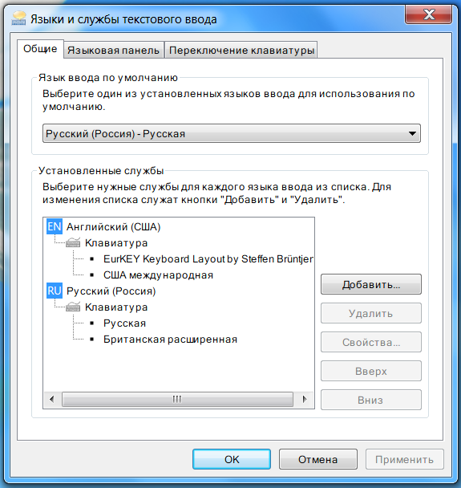

# ru-translit

# Русская латиница от kiwi0fruit (Russcaia Latinicia)

Радикально этимологическая латиница с кучей омофонов для заимствований. Целью было приблизить правила написания к латинским и английским. Но при этом, правила чтения слов едины и не меняются от слова к слову. Ориентированы на не знающих никаких специальных правил людей. Для совместимости с кириллицей аббревиатуры строятся фонетически (как в OK - all correct).

Смысл любой русской латиницы я вижу только в использовании на указателях, латинизации имён, на выпендрёжных вывесках. Редкое использование в URL, никах, именах файлов или коментах. Ну вместо ужасного англотранслита или ужасных славянских латиниц. А вот латинизацию России я считаю плохой идеей и не приветствую.

Являет собой дуальную ASCII-only и диакритическую версии, совместимые между собой. То есть, например, слово из ASCII версии будет значить тоже самое в диакритической версии. Слова, не представимые в кириллице, не являются частью латиницы.

* [Краткое описание](#%D0%BA%D1%80%D0%B0%D1%82%D0%BA%D0%BE%D0%B5-%D0%BE%D0%BF%D0%B8%D1%81%D0%B0%D0%BD%D0%B8%D0%B5)
* [Подробное описание](#%D0%BF%D0%BE%D0%B4%D1%80%D0%BE%D0%B1%D0%BD%D0%BE%D0%B5-%D0%BE%D0%BF%D0%B8%D1%81%D0%B0%D0%BD%D0%B8%D0%B5)
* [Дополнительные примеры](#%D0%B4%D0%BE%D0%BF%D0%BE%D0%BB%D0%BD%D0%B8%D1%82%D0%B5%D0%BB%D1%8C%D0%BD%D1%8B%D0%B5-%D0%BF%D1%80%D0%B8%D0%BC%D0%B5%D1%80%D1%8B)
* [Про диграфы cz и gz](#%D0%BF%D1%80%D0%BE-%D0%B4%D0%B8%D0%B3%D1%80%D0%B0%D1%84%D1%8B-cz-%D0%B8-gz)
* [Аббревиатуры](#%D0%B0%D0%B1%D0%B1%D1%80%D0%B5%D0%B2%D0%B8%D0%B0%D1%82%D1%83%D1%80%D1%8B)
* [Набор на смартфоне](#%D0%BD%D0%B0%D0%B1%D0%BE%D1%80-%D0%BD%D0%B0-%D1%81%D0%BC%D0%B0%D1%80%D1%82%D1%84%D0%BE%D0%BD%D0%B5)
* [Включения иностранных слов без изменений](#%D0%B2%D0%BA%D0%BB%D1%8E%D1%87%D0%B5%D0%BD%D0%B8%D1%8F-%D0%B8%D0%BD%D0%BE%D1%81%D1%82%D1%80%D0%B0%D0%BD%D0%BD%D1%8B%D1%85-%D1%81%D0%BB%D0%BE%D0%B2-%D0%B1%D0%B5%D0%B7-%D0%B8%D0%B7%D0%BC%D0%B5%D0%BD%D0%B5%D0%BD%D0%B8%D0%B9)
* [Требование обратимости латиниц друг в друга - излишне](#%D1%82%D1%80%D0%B5%D0%B1%D0%BE%D0%B2%D0%B0%D0%BD%D0%B8%D0%B5-%D0%BE%D0%B1%D1%80%D0%B0%D1%82%D0%B8%D0%BC%D0%BE%D1%81%D1%82%D0%B8-%D0%BB%D0%B0%D1%82%D0%B8%D0%BD%D0%B8%D1%86-%D0%B4%D1%80%D1%83%D0%B3-%D0%B2-%D0%B4%D1%80%D1%83%D0%B3%D0%B0---%D0%B8%D0%B7%D0%BB%D0%B8%D1%88%D0%BD%D0%B5)
* [Пример текста](#%D0%BF%D1%80%D0%B8%D0%BC%D0%B5%D1%80-%D1%82%D0%B5%D0%BA%D1%81%D1%82%D0%B0)
* [Пример текста ASCII-only](#%D0%BF%D1%80%D0%B8%D0%BC%D0%B5%D1%80-%D1%82%D0%B5%D0%BA%D1%81%D1%82%D0%B0-ASCII-only)

## Краткое описание

Основные написания:

| а | б | в | г | д | е  | ё   | ж | з | и | й | к | л | м | н | о | п |
| - | - | - | - | - | -- | --- | - | - | - | - | - | - | - | - | - | - |
| a | b | v | g | d | ie | ieo | j | z | i | i | c | l | m | n | o | p |

| р | с | т | у | ф | х | ц  | ч  | ш  | щ   | ъ | ы  | ь | э | ю  | я  |
| - | - | - | - | - | - | -- | -- | -- | --- | - | -- | - | - | -- | -- |
| r | s | t | u | f | h | cè | ch | sh | sch | ò | hy | è | e | iu | ia |

Все написания:

| Таблица 1    | ъе   | ъё    | ъя   | ъю   | ъи | ье   | ьё    | ья   | ью   | ьи   | ьо   |
| ------------ | ---- | ----- | ---- | ---- | -- | ---- | ----- | ---- | ---- | ---- | ---- |
|              | ìê   | ìêo   | ìâ   | ìû   | î  | ìe   | ìeo   | ìa   | ìu   | ìi   | ìo   |
| ASCII версия | yiie | yiieo | yiia | yiiu | y  | iiye | iiyeo | iiya | iiyu | iiyi | iiyo |

Каждый второй столбец - ASCII версия:

| Таблица 2                             | е     |       | ё     |     | йо    |      | я     |    | ю     |    |
| ------------------------------------- | ----- | ----- | ----- | --- | ----- | ---- | ----- | -- | ----- | -- |
| **основное написание**                | ie    |       | ieo   |     | io    |      | ia    |    | iu    |    |
| (звучащие) как в Табл. 1              | *T.1* |       | *T.1* |     | *T.1* |      | *T.1* |    | *T.1* |    |
| с большой буквы                       | İe    | Ye    | İeo   | Yeo | İo    | Yo   | İa    | Ya | İu    | Yu |
| после согласной                       | e     |       | eo    |     | ìô    | yiio |       |    |       |    |
| после согласной точно "мягкая" и не Ь | ė     | ie    |       |     |       |      |       |    |       |    |
| в середине слова после гласной        |       |       |       |     |       |      |       |    | ìu    | iu |
| после Й или И                         | è     | ye    | èo    | yeo | ò     | yo   | à     | ya | ù     | yu |
| исключения в начале слова             | È/è   | Ye/ie |       |     |       |      |       |    |       |    |

| Таблица 3                  | э  |    | о  |    | а  |    | у  |    | ы  |    |
| -------------------------- | -- | -- | -- | -- | -- | -- | -- | -- | -- | -- |
| **основное написание**     | e  |    | o  |    | a  |    | u  |    | hy |    |
| после согласной            | ê  | ae |    |    |    |    |    |    | y  |    |
| после согласной + А        | ê  | ae |    |    |    |    |    |    |    |    |
| после И                    | ê  | e  | ô  | o  | â  | a  | û  | u  |    |    |
| после Ы                    | ê  | ae | ô  | oo | â  | aa | û  | uu |    |    |
| исключения после согласной | ae |    |    |    |    |    |    |    | î  | y  |
| исключения в начале слова  | âe | e  |    |    |    |    |    |    |    |    |

|                            | и  |    |                                | й       |     |
| -------------------------- | -- | -- | -------------------------------| ------- | --- |
| **основное написание**     | i  |    | **основное написание**         | i       |     |
| после И                    | ŷ  | y  | после И                        | y       |     |
| после других гласных       | î  | ii | звучащие как в Табл. 1,2       | *T.1,2* |     |
| перед АОУЭИ                | i  | ii | перед согласной в начале слова | ì       | ii  |
| исключения после согласной | ỳ  | i  | между согласными               | òì      | -ii |
| другие исключения          | y  | i  | после согласной в конце слова  | òì      | -ii |

|                                | ъ         |      | ь         |      |
| ------------------------------ | --------- | ---- | --------- | ---- |
| как в Табл. 1,2,4              | *T.1,2,4* |      | *T.1,2,4* |      |
| после ШЩЧЖ                     |           |      | è         | None |
| между согласными               | ò         | -    | è         | ii   |
| после согласной в конце слова  | ò         | None | è/e \*    | ii/e |
| исключения между согласными    |           |      | ì         | ii   |
| иначе                          | -         |      | -         |      |    

\* в случае аналога открытого слога (гласная + однобуквенная-согласная + e) e на конце считается мягким знаком è. Для того, чтобы написать аналогичное Е (йэ) нужно использовать ė или ê: cone, o conė. Не распространяется на kè, gè (который "ж" в заимствованиях, ge - ге, ghè - гь), jè (жь) и все модиф. диакритикой согласные (см. след раздел).

|                        | к  |    |                        | ц        |        |
| ---------------------- | -- | -- | -----------------------| -------- | ------ |
| **основное написание** | c  |    | **основное написание** | cè/ce \* | cii/ce |
| перед ЕЁИ              | k  |    | перед ЕЁЭИЫ            | c        |        |
|                        |    |    | перед ОАУ              | ci       |        |

\* в случае аналога открытого слога (гласная + c + e) e на конце считается мягким знаком è. Для того, чтобы написать аналогичное ЦЕ нужно использовать ê: zaiace, o palicê. 

| Таблица 4    | ЪЭ  | ЪЫ   | ЪО  | ЪА  | ЪУ  | ЬЭ          | ЬЫ          | ЬА          | ЬУ          |
| ------------ | --  | ---- | --- | --- | --- | ----------- | ----------- | ----------- | ----------- |
|              | òhê | òhy  | òhô | òhâ | òhû | ìe/ė/èhê \* | ìi/ỳ/èhy    | ìa/ia/èhâ   | ìu/iu/èhû   | 
| ASCII версия | -e  | -hy  | -o  | -a  | -u  | iiye/ie/e-e | iiyi/i/e-hy | iiya/ia/e-a | iiyu/iu/e-u |

\* три варианта, ибо вариантов чтения сьэ тоже три: как сье/се/сь-э.

**Значение диакритики:**

|   |   |
| - | - |
| İ | йотация в начале слова с заглавной буквы |
| Èè&nbsp;Ì&nbsp;ì&nbsp;Òò | два мягких и твёрдый знаки после согласных (так же в середине слова как ìu - для визуального разделения) |
| Ėė&nbsp;Ï&nbsp;ï&nbsp;Ȯȯ&nbsp;Ỳỳ&nbsp;Àà&nbsp;Ùù | гласные, смягчающие предыдущую согласную |
| Èè&nbsp;Òò&nbsp;Àà&nbsp;Ùù | йотированные гласные после Ìì или Ii (а так же Е (йэ) в начале слова) |
| Êê&nbsp;Î&nbsp;î&nbsp;Ôô&nbsp;Ŷŷ&nbsp;Ââ&nbsp;Ûû&nbsp;Ŵŵ | гласные, делающие предыдущую согласную твёрдой или разбивающие диграф с предыдущей гласной (во втором случае звучание гласных Ii,Yy не становится твёрдым) |
| Ẹẹ&nbsp;Ị&nbsp;ị&nbsp;Ọọ&nbsp;Ẏẏ&nbsp;Ạạ&nbsp;Ụụ | альтернативное чтение предыдущей согласной (ЕеИиОоИиАаУу) |
| Éé&nbsp;Í&nbsp;í&nbsp;Óó&nbsp;Ýý&nbsp;Áá&nbsp;Úú&nbsp;Ẃẃ | ударения |
| Ēē&nbsp;Ī&nbsp;ī&nbsp;Ōō&nbsp;Ȳȳ&nbsp;Āā&nbsp;Ūū | "твёрдые" ударения |
| Ěě&nbsp;Ǐ&nbsp;ǐ&nbsp;Ǒǒ&nbsp;Ǎǎ&nbsp;Ǔǔ | "мягкие" ударения |

**Экспериментальное:**

1) iescheo всегда пишется как iesche. Бывшее iesche - как ieschė.
2) на конце слов заменять -ciṣm (цизм) на -cism, старый -cism заменять на -cissm
заменять -iṣm$, -iṣma$, -iṣmy$,... (все падежи всех чисел) на -ism$,...
старые -ism$ заменять -issm$
3) cтоит делать различение мужского и женского рода на конце слов в случае аналога открытого слога: tenè, cone.

|                      |      |
| -------------------- | ---- |
| сч (только [ɕː])     | sch  |
| сч ([ɕˈt͡ɕ] или [ɕː]) | shch |
| шч                   | shch |

Одно и то же слово с "шч" (shch) часто альтернативно читается как [ɕˈt͡ɕ] или [ɕː], поэтому писать так же читающиеся "сч" довольно уместно - когда раздельное чтение: rashchuvstvovalsia [rɐɕˈt͡ɕustvəvət͡sə], rashchleneniè [rəɕt͡ɕlʲɪˈnʲenʲɪje]. А вот vesnushchatyi читается либо как [vʲɪsˈnuɕːɪtɨj], либо как [vʲɪsˈnuɕt͡ɕɪtɨj]. И тут читатель сам определяет, что это [ɕˈt͡ɕ], а не [ɕː] или [ʂt͡ɕ] (Ашчян). А вот "sch" это всегда [ɕ], [ʂ] или [ɕː].

**Новые буквы:**

Ḅḅ Çç Ḍḍ Ĝĝ Ġġ Ḥḥ Ḫḫ  
Ĵ ĵ Ɉ ɉ Ḳḳ Ḷḷ Ṇṇ Ṭṭ Ṣṣ Ẓẓ Ẑẑ  
Ẹẹ Ị ị Ọọ Ạạ Ụụ Ẏẏ  
Ėė Ï ï Ȯȯ İ  
Èè Ì ì Òò Ỳỳ Àà Ùù  
Êê Î î Ôô Ŷŷ Ââ Ûû Ŵŵ  
Éé Í í Óó Ýý Áá Úú Ẃẃ  
Ēē Ī ī Ōō Ȳȳ Āā Ūū  
Ěě Ǐ ǐ Ǒǒ Ǎǎ Ǔǔ

**TODO**:

Придумать пометку слов капсом, которые не аббревиатуры. Проработать слова в смешанном регистре.

Немного замечаний о "сч", которые могут быть полезны для обращения латиницы:

* счлен - в остальных случаях перед согласной это всегда щ,
* щьте, щьтесь, щься - других щь{cons} не бывает,
* не бывает слов, у которых на конце щте, щтесь, щся,
* счь вообще не бывает,
* во всем корпусе текста 500 мб всего одно вхождение (сч|СЧ)\W
* во всем массиве текста 500 мб не было ни случая сч\W

## Подробное описание

Из-за этимологической и орфографической сложности освоение латиницы возможно только с помощью умного ввода, при котором происходит замена неправильно написанных слов. Например, благодаря принципу единственности прочтения, правильно и неправильно написанные слова имеют один и тот же прообраз в кириллице.

**Адаптация заимствований производится с помощью следующих обозначений:**

ḅḥ вх  
ḅh б  
bh бх  
ḍh д  
dh дх  
gh г  
gḥ гх  
kh х  
kḥ кх  
ḷh л  
lh лх  
ph ф  
pḥ пх  
rh р  
rḥ рх  
ṭh ф  
th-theo(theô)-thėo т-тео-тё  
tḥ тх  
sh ш  
sḥ сх  
ṣh с(ь)  
jh жх  
jḥ джх  
wh в  
wḥ вх  
zh ж  
ẓh чж  
zḥ зх

ng нг  
ṇg н  
ck к  
cḳ кк

cḥ-cḥè-cḥy х-хь-хи  
çh к  
çḥ чх  
ch ч (уд. ché, chá)  
çhè-chê-châ ш-ше-ша (уд. chē, chā)  
chẹ-None те-т(ь) (уд. chě)

sch щ  
sch-shch сч(только [ɕː])-сч([ɕˈt͡ɕ] или [ɕː])  
sçhè-schê-schâ сш-сше-сша (уд. schē)  
ṣch ш (уд. ṣchá)  
sсḥ сх  
ṣ з  
ḅ в 

çs-cẹ-ça-cị(cẏ)-çy-çae(çê) с(съ)-се-са-си-сы-сэ (уд. çé, çá, çí, çý, çȳ)  
cè-ce(cae-cê)-cia-ci(cy)-cìa ц-це-ца-ци(цы)-цья (уд. cé, ца-ciá, cí, cý, циа-ciā)  
ch-cė-cïa-cï ч-че-ча-чи (уд. cǐ, cě)  
kè(ckè)-с(k,ck)-ke(càe,cke)-ki(ky,cki)-cky-cù(ckiu,kiu)-câe кь-к-ке-ки-кы-кю-кэ

g-ge(gàe)-geo(geô)-gėo-gae(gâe)-gi(gy)-ghy-ghè-ghìe г-ге-гео-гё-гэ-ги-гы-гь-гье (уд. gé, gá)  
gè-gê-gêa(gîa)-gŷ ж-же-жа-жи (уд. gē, gā)  
ĝè-gẹ-gị(gẏ)-gẹa(gịa) дж-дже-джи-джа (уд. ĝé)  
dgè-dgê дж-дже

hy ы (уд. ḫý)  
hê-hâ-hî(hŷ) э-а-и (уд. hē,hā,hī-hȳ)  
NO-hẹ-hạ-hịu-hẏ(hị) г-ге-га-гю-ги (уд. hé, hí, hý)  
ḥè-ḥy-h-he-hi(hỳ)-ḥiu хь-хы-х-хе-хи-хю (уд. ḥé)  
hia-hie я-е

dje дже  
j-jè-jj-je-ja(jèa)-ji-jiâ-jèi ж-жь-жж-же-жа-жи-жиа-жй (уд. jí-já)
 
ġh-ġhè-ġe х-хь-хе (уд. ġé, ġē)  
ɉi-ɉa-ɉe-ɉh ха-хи-хе-х (уд. ɉí-ɉá-ɉé)  
ì-jì-jà-jė-jò й-йи-я-е-йо (уд. jǐ-jǎ-jě)

ĵ-ĵj-jê-jâ-jî дж-джж-дже-джа-джи (уд. jī-jā)  
jị-jạ-jẹ дзи-дзя-дзе (уд. ĵí-ĵá-ĵé)  
jï-jia цзи-цзя (уд. ĵǐ-jiá)  
ɉj чч  
ɉị-ɉạ-ɉẹ чи-чя-че (уд. ɉǐ-ɉǎ-ɉě)

ẓ-ẓe-ẓi(ẓy) ц-це-ци (уд. ẓá)  
ẓạ-ẓị(ẓẏ)-ẓz цза-цзы-цз (уд. ẓā)  
zạ-zị(zẏ) дза-дзы (уд. ẑá)

tṣ ц  
tẓ ц  
rz рз  
rzh рж  
rẓ ж  
sz сз  
sẓ ш  
cz кз  
cẓ ч

x-xiâ кс-ксиа  
xia ся

{cons}ou {cons}у

----

Смягчение гласных делается акутом (áú), сделать, наоборот твёрдыми - грависом (èì). Буквы Кк и Цц даются с помощью Cc: твердые - Кк, мягкие - Цц. У сочетаний th,ch,j,g,dj,dg можно изменить звучание с помощью букв ò,èìóàùỳ, а у букв b,w - с помощью èìóàùỳ. В альтернативных этимологических вариантах приоритет у латинской этимологии, следом - английской. Если ни та, ни эта этимология, то используется изначальный язык, ближайший к латыни. Например: кинематограф - kinematograph (нем.) - cinématographe (фр.) => cìnematograph.

ъ - ò, qh (не после согл.)  
ь - é, qh  

а - a, à (после букв с изм. звуч.), à (иногда после гласн.)  
о - o, ó (после букв с изм. звуч.), ò (иногда после гласн.)  
у - u, ù, ù, w (этимлг. изм. звуч.)  

е - je, e (после согл.), é (после "й" / после i в оконч.), è (после букв с изм. звуч.)  
ё - jeo, éo, éo, èo, jo (после "е")  

ю - ju, ú (после согл., "й" / после i в оконч.)  
я - ja, á  

и - i, í (после гласн. кроме иы / после йь / загл. в нач. слова), ì (этимлг. после Кк / после букв с изм. звуч.), y (после Кк / этимлг.), ý (этимлг.), ỳ (этимлг. после букв с изм. звуч.)  
ы - ỳ, y (когда рядом только согл. звуки), ì (этимлг.), òi (этимлг. после Бб)  
э - e, è (после согл. / иногда после гласн.), ae (этимлг. / после Бб)  
й - j, i (после гласных кроме ыи не перед гласн. или "й"), ji (перед ауэ), y (этимлг.)  

б - b,  
в - v, этимлг.: b (изм. звуч.), bh, w, wh  
г - g, gh (перед ъьз / этимлг.)  
д - d,  
ж - gz, gj (этимлг.), zh (этимлг. изм. звуч.),  
з - z,  
к - c, этимлг.: k, ck, qù, qú  
л - l,  
м - m,  
н - n,  
п - p,  
р - r, rh (этимлг.)  
с - s,  
т - t, th (этимлг.)  
ф - f, ph (этимлг.), th (изм. звуч. этимлг.)  
х - h, ch (изм. звуч. этимлг.)  
ц - c, cz (не перед гласн.), этимлг.: cz, tz, czz  
ч - ch,  
ш - sh,  
щ - sch  
кв - cv, qv (этимлг.)  
кс - cs, x (этимлг.)  
кз - ckz, xz (этимлг.)  
дж: этимл. изм. звуч.: j, g, dj, dg  
чж: zh (этимлг.)

Полезно помнить, что после согласных: ò/ъ и é/ь.

*После слэша дано написание в ASCII-only версии. Требования этимологии распространяются только на основу слова.*

Я поленился дописать в таблицу чж/zh, ж/zhò по тому же принципу альтернативного прочтения: zha/чжа, zhà/жа.

|     |     |     |     |
| --- | --- | --- | --- |
| г | gh | перед зьъ или где этимология требует h | ghippopotam, zighzag, Buchghàlter / Bukhghalter, Alighjeri Алигьери, adgheziá |
| гэ | gae | всегда |     |
| гы | gy | всегда |     |
| ж | gz | всегда перед ьъ | dgzé / dgzj джь |
| жз | gjz |     |     |
| ж | gj | где этимология требует g/ж или j/ж - но не после d или перед h | gjurnal, degjavú дежавю, Gjeorgj Жорж |
| дж | dg[èìỳò] / dgj | где этимология требует dg | búdgèt / byudgjet, poridgò поридж, podgzidal, ogzidal, podgibaté, zagibaté, podgon, Sandgerdi / Сандгерди |
| дж | g[èìỳò] / gjh | где этимология требует g - но не после d | Gèorgò / Gjhyorgjh Джордж, Gìuljetta / Gjhuljetta, Gìovanni / Gjhovanni, gìn / gjhin / джин, Gèòrgò / Gjheorgjh / Джеордж, Energỳ / Energjhy Энерджи |
| дж | jae, j[èìòóàùỳh] / jh | где этимология требует - но не после d,g | Jaeims, Jàems / Jhaaems Джаэмс, Jàrmush, jìnsy, Jaeck, Jèrsý, hajjò / hajjh, jóker, ỳjỳd / yyjhyd ыджыд - альтернативный вариант |
| дж | djae, dj[èìòóàùỳh] / djh | где этимология требует dj |     |
| ж | z | после ж/gz |     | gzugzzit |
| ж | j | после ж/gj |     |
| джж | jjò / jjh |   | hajjò / hajjh |
| бэ | bae | всегда | Baecon |
| бы | bòi / by | где этимология требует i | obòisc |
| в | bh | перед согласными или в конце слова, где этимология требует b | febhralé |
| в | b[èìóàùỳ] / bh | перед гласными где этимология требует b | sýmból / syimbhol, Bỳzantiá / Bhyzantija, Bàbỳlon, djaból |
| р | rh | где этимология требует rh | rhythm |
| т | tò / th | перед з | otòzyv / othzyv |
| т | th | где этимология требует th, "тъ" с использованием th не бывает | mathematica, theoriá, theologiá, Theodor, orthogonalényj |
| ф | th[èìòóàùỳ] / fh | где этимология требует th | Thèodor / Fhyodor Фёдор, orthógraphiá орфография, scythò скиф, scyth - скит |
| ф | ph | где этимология требует ph | telephon |
| х | ch[èìòóàùỳ] / kh | где этимология требует ch или kh | chìmera / khimera, chór, Czúrichò / Czyurikh Цюрих |
| х | ch[\c][èìóàùỳ] / kh[\c][eioauy] | перед согласной+гласной где этимология требует ch или kh | Chrìstos, Lochnèss / Lokhness, Lochònèss / Lokhnaess, Lachònaes / Lokhnaess, Lochénèss / Lochnaess Лочнэс, buchghàlter, chtónichescyj хтонический, chtèonichescyj хтёнический |
| х | òh / kh | после согласных | sòhod / skhod |
| х | òch / kh | после "с/s" когда этимология требует ch | rasòchìmera / raskhimera расхимера |
| ч | c | перед ч | capricchio |
| щ | sch (shch) |     |     |
| сч | sch (sçh / ssch) |     | вторые варианты нужны только при выходе за словарь известных слов    |
| ссч | ssçh / sssch |     |     |
| шч | shéch / shjch |      | vesnushéchat |
| шьч | запрещен |     |     |
| в | wh | когда этимология требует wh | Whaitran Вайтран |
| у | w[èìóàỳ] / wu,ww | перед гласными когда этимология требует w - кроме уу | Wótson / Wuotson Уотсон, Wèst / Wuest Уэст, brawùzer / brawwzer браузер, ударение: brawũzer |
| в | w | когда этимология требует w | Watson Ватсон, Watt Ватт, Wurst, Wuàt / Wuuatt Вуатт |
|     |     | *Специальные комбинации, чьё звучание изменяется буквами èìòóàùỳ: b,w,th,ch,j,g,dj,dg, звучание **b,w НЕ** меняется буквой Òò.*    | *После b,w,th,ch,j,g,dj,dg - Óó не смягчает, а полностью меняет звучание предыдущей буквы. Как и после Cc.* |
|     |     |     |     |
|     |     |     |     |
| к | ck | когда этимология требует ck или ch | hockei - исключение, Mackiavelli, Maickl, за компанию: Mishelé, Michàelé |
| к | k | когда этимология требует k | Keniá, kefir, koboljd, koala, karate |
| кс | x | где этимология требует x, но только не на стыке морфем | taxi, Xeniá |
| кз | xz | где этимология требует x, но только не на стыке морфем | exzamen |
| кз | ckz | иначе | eckzema |
| кх | ckh |    | sickh |
| кв | qv | когда этимология требует q | aqvarium |
| ки | cì / cki | где этимология требует ci | cìno / ckino кино, cìnematograph |
| ки | cy |     | recy, reca |
| ке | cè / cke |     | ocèan / ockean, cèntavr / ckentavr, v recè / v recke |
| кы | cky |     | alenéckyj |
| кэ | cae | всегда |       |
| к | c | иначе |     |
| к[иеяё] | qú[ieao] / qk[ie],qky[ao] | когда этимология требует qu | marqúiz, teqúila, banqúir, qúilé, maqúet, piqúet, liqúor, anqúeta |
| к[оа] | qù[oa] / qk[oa] | когда этимология требует qu | qùarantin |
|     |     | *Примеры:* | ocèan, cèntavr, cìno кино, cìnematograph, cyber, cysta киста, cìrasa кираса, ascèt аскет, ancker анкер, scèptic скептик, Cyrill, Cypr, scythò, cyt кит, cynolog |
|     |     |     |     |
|     |     |     |     |
| -ция | -tziá / -tzija | где русское словообразование эквивалентно латинскому "-ia", превращающемуся в "tia". Все русские -ция с этим же смыслом так же надо причесать под эту форму | fractziá, militziá, militzai, politziá, instructziá |
| ц | tz | где этимология требует t, но не требует "c". Тут много какие латинские суффиксы могут быть: -tiō, -tion | ratzion, tzundere, tzigan |
| цц | tzz | когда этимология требует t, но не требует Cc |     |
| ц | cz / cz | где этимология требует z, но не требует t | Ponczi, Czúrichò / Czyurikh Цюрих |
| цц | czz | когда этимология требует Cc или z, но не требует t | piczza |
| ци | cý / cyi | где этимология требует Yy, но не на конце слова | cýan / cyian циан, cýcl |
| цы | ci | в словах-исключениях | cipléonoc |
| цы | cý / cyi | иначе | otcý / otcyi |
| ц[иеё] | c[ie], céo / czyo | иначе | cedité, otcedité, accent, Ciceron, Cezaré, Céos / Czyos Цёс |
| ц[аоу] | c[áóú] / cy[aou] | иначе | latinicá, jaicó / jaicyo |
| ц | ç / cz | в транскрипционная система Палладия - где противопоставление твердых-мягких гласных | çá ця, cá ца, Çúané / Czyuanj Цюань |
| ц | cz | иначе | zajacz |
|     |     |     |     |
|     |     |     |     |
| е | e | после согласных | leto |
| е | é / je | после й, после "и" в окончаниях | sinié / sinije, Bajés / Bajjes |
| е | je | иначе | Jevropa, podòjezd / podjiezd, pjesa |
| ё | yo / yo | где этимология требует именно yo | Yoda    |
| ё | éo / yo | после согласных | méod / myod, geograph географ |
| ё | éo / jeo | после й, после "и" в окончаниях | mumiéo / mumijeo, mumiéò / mumijeeo, jéogz / jjeogz йёж, jéògz / jjeeogz йеож |
| ё | jo | после "е" | jejo, nejo, nejio / нейо |
| ё | jeo | иначе | jeogz, podòjeom / podjieom, pjeom, pjeòm / pjeeom пьеом |
| ещё | ещё$ / (j)esche$ | исключение для ещё на конце слова | jesche ещё, jeshchíe / jeshchiie ещьэ - звучит как "ще" |
| ю | yu / yu | где этимология требует именно yu | Mayuri    |
| ю | ú / yu | после согласных | lúbimyj / lyubimyj |
| ю | ú / ju | после й, после "и" в окончаниях | Juliú / Juliju |
| ю | ju | иначе | jula, pju |
| я | ya / ya | где этимология требует именно ya | nya |
| я | á / ya | после согласных | sinája / sinyaja |
| я | á / ja | после й, после "и" в окончаниях | Mariá / Marija, allilujá / allilujja, sijaté - не окончание, pajaté - морфемы не мутируют |
| я | ja | иначе | ja я, pjan |
|     |     |     | *já,jú,jé,jéo,jý создают дополнительную йотацию, а jí не создаёт дополнительную йотацию, а jó вообще джо.* |
|     |     |     |     |
|     |     |     |     |
| и | í / i | в начале слова перед гласной или йотом с заглавной буквы | Íacov / Iacov, Íesus / Iesus - исключение, ion / ion |
| ии | íy / iy | в начале слова с заглавной буквы перед согласной | Íyda / Iyda |
| и | í / ii | после гласных (кроме и,ы), или просто после й | moí / moii мои, rajíspolcom / rajiispolcom, superòjíp / superjiip суперйип, Luí / Luii, zaíca / zaiica |
| и | jí / jy | после ь | platjíce / platjyce |
| и | y | в исключениях где этимология требует "y" и где нельзя спутать с "ы" | Yggdrasilé Иггдрасиль |
| и | ý / yi | в исключениях где этимология требует "y" | sýstema / syistema, gýmanziá, gýroscop |
| и | i | обычно - в т.ч. "ии" в конце слова | bacterii, mir |
|     |     |     |     |
|     |     |     |     |
| ы | ì / y | когда этимология требует i | muzìca / muzyca, latìnè / latynj |
| ы | y | после согласного звука (в т.ч. йота) и одновременно перед: согласным звуком (в т.ч. йотации), или нейотированными гласными аоуиыэ, или в конце слова | ty, crasnyj, crasnyje, vyùchil / vyyuchil, vyíscyvaté / vyyiscyvatj, tyè / tyye тыэ, jyò / jyyo йыо, sòjyí / sjiyyi сйыи, jys йыс, sòjys / sjiys сйыс, tyy тыы - можно удваивать, но platjíce / platjyce |
| ы | ỳ / yy | в остальных случаях | ỳdgzyd / yydgzyd ыджыд, aỳ / ayy аы |
|     |     |     | *Тут можно заметить, что Ee после согласных это Ее, а не после согласных - Ээ. А Yy после согласных, хоть и с оговорками, - это Ыы, а иначе - Ии.* |
|     |     |     |     |
|     |     |     |     |
|     |     | ghy,phy,thy,rhy,chỳ(khy),cy | всегда ги,фи,ти,ри,хи,ки |
|     |     | gy,fy,ty,ry,hy/òhy(xhy),ky/cky | гы,фы,ты,ры,хы,кы |
|     |     | *Примеры:* | ghypotheza, phyzica, tachỳony |
|     |     |     |     |
|     |     |     |     |
| э | è / ae | после Аа | aèro / aaero, maèstro / maaestro |
| э | ae / ae | когда этимология требует Aa | maer, Thaetcher, Aeppl, Aendý / Aendyi |
| э | è / ae | обычно после согласных | partèr / partaer |
| э | e | иначе | etot, erotica |
|     |     |     |     |
|     |     |     |     |
| ъ | j | перед йотированными гласными - съ[ёеюя] — sòj[oeua] / sji[oeua] | sòjezd / sjiezd, zajezd |
| ъ | ò / qh | в остальных случаях после согласных, кроме j,w | obòizvestité / obqhizvestitj объизвестить |
| ъ | qh | иначе | aqh аъ |
|     |     |     |     |
|     |     |     |     |
| ь | j | перед йотированными гласными кроме "ё" - сь[еюя] — sj[eua] | pjesa |
| ьё | jeo | сьё — sjeo | pjeom |
| ь | í / ii | перед нейотированными гласными кроме "и,о" - сь[ыэуа] — sí[yeua] / sii[yeua] | belíetagj бельэтаж - звучит как "лье",  partíer / partiier партьэр - звучит как "те". Нужно все исключения прочтения писать йотированно - beljetagj |
| ьи | jí | сьи — sjí / sjy | platjíce / platjyce, creslice |
| ьо | jo | сьо — sjo | buljon |
| ь | j / j | после согласных в заимствованиях где по этимологии не было дополнительного смягчения | culjtura, paljma |
| ь | é / j | после согласных | conécy / conjcy коньки, léda / ljda льда, scolézcyj |
| ь | qh | иначе запрещено | aqh аь становится аъ |
|     |     |     |     |
|     |     |     |     |
| й | y | где этимология требует | yippi, York, superòyippi / superqhyippi, superéyippi / superiiyippi - альтернативная этимологичная форма, tonjyork тоньйорк |
| й | ji | после согласной перед согласной или в конце слова; перед нейотированными гласными ауэ - кроме иыо | sjis сйс, sés / sjs сьс, sòjie / sqhjie сйэ, sòie съиэ, ajia айа, ejien эйэн |
| й | j | перед "о" **не** после согласной | jod, major |
| йо | (ò)jo / jio |     | Séorkòjosen / Syorkjiosen Сёркйосен |
| йи | jí / jii |     | rajíspolcom / rajiispolcom, jíp / jiip, superòjíp / superjiip |
| йы | jy |     | jyí / jyyi йыи |
| й | i | после гласных не перед гласными - кроме ий,ый | moi мой, poimal поймал, dui дуй, dúim дюйм, Einshtein, zaíca / zaiica заика |
| й | j | иначе - в т.ч. ий,ый | allilujá / allilujja, sinij, crasnyj |

### Дополнительные примеры

сьйя/sjjja/séjá, сйя/sjija/sjiá, сьйс/sjjis/séjis, сйс/sjis.

Уточнение мягкости: parter, partíer/partiier, partèr/partuer.

Обратите внимание, что йот+твердая гласная (аоуэ) даёт мягкое звучание гласной (a => æ, o => ɵ, u => ʉ, ɛ => e, так пусть и ɨ => i будет). То есть, фонетика строится в предположении, что йы и йи звучат одинаково.

### Про диграфы cz и gz

Стоит отметить, что рукописная буква z выглядит либо как рукописная цифра 2 с угловатым верхом, либо как кириллическая рукописная "з" с хвостиком внизу, но более угловатая сверху. Когда z отдельно это смотрится нормально, а вот в диграфах cz и gz оба варианта написания z смотрятся плохо. В этом случае стоит использовать специальные рукописные лигатуры. Для cz - рукописная "ц" с петелькой, "c" идет в первую палку "ц", а "z" (вариант с петелькой) идет во вторую палку "ц" и петельку (заглавный вариант тоже должен выглядеть как рукописная "Ц"). Для gz - рукописная "g", к которой справа вплотную добавлена кириллическая буква "з" без петельки внизу (будто стяжка на правой дуге рукописной буквы "ф"). Заглавный вариант выглядит как рукописная "G", у которой внутренняя палочка является началом рукописной "z" (вариант с петелькой). Обе лигатуры легко писать и они имеют в себе логическую связь с составляющими их буквами.

### Аббревиатуры

В латинице используются фонетическо-кириллические аббревиатуры, которые вопреки записи сокращают по звучанию. Таким образом, названия букв в аббревиатурах (а так же диграфы) будут читаться как в кириллице.

Изменения в названиях букв и диграфов (сокращения по звучанию опираются на названия букв):

* **Aa**
  * **Áá** - я (Á., FIÁ)
* **Bb**
* **Cc, Çç** - це (C., ÇPU, перед EI в аббревиатурах - просто C)
  * **Ch** - че (Ch., ChS)
* **Dd**
* **Ee, Éé** - е (E., ÉGÈ, после согласных (кроме ЙЖ) в аббр. - просто E)
  * **ÉÓéó** - ё (Éo.) / **Èè** - э (È., ÉGÈ)
* **Ff**
* **Gg** - гэ (была "же" в математике)
  * **GJ** - же (Gj., OBGJ) 
* **Hh** - ха (H., KHL, была "аш" в математике)
* **Ii** / **Jj** - йот (была "жи" в математике и "и-краткая" в алфавите)
* **Kk** - ка / **Ll** - эль, в аббр. - "эл"
* **Mm, Nn, Oo, Pp** / **Qq** - ку / **Rr**
* **Ss**
  * **Sh** - ша (Sh., VSh) / **Sch** - ща (Sch., MSch)
* **Tt**
* **Uu**
  * **Úú** - ю (Ú. ÚAR)
* **Vv** / **Ww** - дубль-вэ, в аббр. - "ву" / **Xx** - икс
* **Yy** - игрек, в аббр. - "игр"
  * **Ỳỳ** - ы (Ỳ.)
* **Zz** - зэт, в аббр. - "зэ" (была "зэ" в алфавите)

Символы (комбинации) внутреннего уровня не являются самостоятельными буквами, но при этом имеют отдельные названия и входят в состав (фонетически образованных) аббревиатур - это нужно для совместимости с кириллицей.

В скобках указаны ASCII-only обозначения.

| **А**  |     **О**      |  **У**  | **Э**  |  **Ы**  |
|:------:|:--------------:|:-------:|:------:|:-------:|
| A / À  |       O        |  U / Ù  | È (Eh) |  Ỳ (Yh) |
| **Я**  |     **Ё**      |  **Ю**  | **Е**  |  **И**  |
| Á (JA) | EÓ (Eo) / ÉÓ (JEo) | Ú (JU) | E / É (JE) | I / Í / Ý |
| **Б**  |     **В**      |  **Г**  | **Д**  |  **Ж**  |
|   B    |       V        |  G / Gh |   D    |   GJ    |
| **З**  |     **Й**      |  **К**  | **Л**  |  **М**  |
|   Z    |   J / J (JI)   |    K    |   L    |    M    |
| **Н**  |     **П**      |  **Р**  | **С**  |  **Т**  |
|   N    |       P        |    R    |   S    |    T    |
| **Ф**  |     **Х**      |  **Ц**  | **Ч**  |  **Ш**  |
|   F    |       H        | C / Ç (Cj) | Ch  |   Sh    |
| **Щ**  |  **ШЧ, СЧ**    |  **ГЙ** |        |         |
|  Sch   |   ShCh, SCh    |   GhJ   |       |         |

* в аббр. Ц перед EI - просто C, иначе - Ç,
* в аббр. Е после согласных (кроме ЙЖ) - просто E (EÓ), иначе - É (ÉÓ),
* в аббр. в АСКИ версии Й перед АУИ - JI, иначе - J,
* в аббр. в диакритической версии АУИ после ЙЖ пишутся ÀÙÍ,
* после строчных букв буква И в аббревиатуры идёт как Ý.
* сочетание ГЙ пишется GhJ

*Буква Cc называется Це и в аббревиатуры идёт как Ç/C. И обозначает она там начальнй __звук__ Ц. А все начальные звуки Ка в аббревиатурах обозначаются K. Carina Petrova => K.Petrova. Ciceron Romanov => C.Romanov. ÇPU.*  

GJÍ ЖИ (GJI), GJZL ЖЗЛ, GZI ГЗИ, TZ ТЗ,  
SZI СЗИ, ShÝ ШИ (ShI), SHI СХИ,  
ÉGÈ ЕГЭ (JEGEh),  
GE ГЕ, GÈ ГЭ (GEh), GI ГИ, GỲ ГЫ (GYh),  
GJÉ ЖЕ (GJJE), GJÈ ЖЭ (GJEh), GJÍ ЖИ (GJI), GJỲ ЖЫ (GJYh), GzA ГзА,  
CI ЦИ, ÇZI ЦЗИ (CZI), ÇA ЦА (CA), ÇZA ЦЗА (CZA), ÇzA ЦзА (CzA),  

KE КЕ, KÈ КЭ (KEh), KI КИ,  
GH ГХ, GZ ГЗ, KZ КЗ, KHI КХИ, NH НХ, NHI НХИ,  
SChÝ СЧИ (SChI), SchÝ ЩИ (SchI), SCh СЧ, SchU ЩУ,  
CI ЦИ, ChÝ ЧИ (ChI), ShÝ ШИ (ShI), SHI СХИ,  
JÈ ЙЭ (JEh), JÉ ЙЕ (JJE), JÍ ЙИ (JII), JÀ ЙА (JIA).

ÉGÈ ЕГЭ (JEGEh), OBGJ ОБЖ, ÇPU ЦПУ (CPU), ChS ЧС, SShA США, ÈÈG ЭЭГ (EhEhG), GJÈK ЖЭК (GJEhK), GJKH ЖКХ, NHL НХЛ, KHL КХЛ, ÉKA ЕКА (JEKA), FIÁ ФИЯ (FIJA), CERN ЦЕРН, OBSE ОБСЕ, GIBDD ГИБДД, ChIM ЧИМ.

Возможно использование исключений типа Nju York => NY вместо NJ, т.к. Y свободна для смысла йота в аббревиатурах.

### Набор на смартфоне

Оптимально удобный ввод на смартфоне - с помощью проприетарных клавиатур со свайпом. Расширений для самых популярных GBoard и Swift я не обнаружил. Добавить прямо в код клавиатуры Гугла русскую латиницу можно было только если бы был единый стандарт русской латиницы. Это не реально.

Так что остаётся только использовать одну из уже существующих раскладок и импортировать собственный словарь - GBoard позволяет экспортировать и импортировать свои слова (свайп с ними работает, нужно надеяться, что нет ограничения по количеству слов...).

Описание выше, является довольно существенным ограничением на проектирование латиницы.

А как можно использовать уже существующую клавиатуру в GBoard? Адаптировать её под письмо в стиле US-international. То есть, клавиатура должна иметь выделенные кнопки под апостроф и, возможно, грэйв. А так же она должна мочь при долгом нажатии печатать буквы с диакритикой, используемые в латинице (US-international тоже должна их печатать). Тогда если в словарь пользователя добавить импортом словарь слов в русской латинице с сокращениями ввода типа m'aso => máso, то сценарии печати на swype будут совпадать со сценариями печати в US-international.

В моей текущей латинице я рассматриваю вариант использования акутов для мягкости, а грэйвов - для твёрдости (i,í - и, y,ì - ы, á - я, è - э). Но, стоит отметить, что при долгом нажатии нужны только частые буквы. А вот буквы для ударений и аббревиатур вполне можно печатать через подсказки специальных автозамен из личного словаря 'a' => ǎ (á под ударением), a' => â (a под ударением) - как предложено [тут](https://android.stackexchange.com/questions/224043/gboard-set-custom-unicode-characters-on-longpress-or-add-custom-keyboard-keys-o).

Точно так же как в US-international тоже обязательны только частые буквы, а буквы для ударений и аббревиатур можно использовать из EurKey (для удобного переключения между US-international и EurKey нужно дефолтным языком сделать русский - это позволит удалить дефолтную раскладку US). Приоритет должен быть у EurKey, т.к. он содержит неизменённую оригинальную раскладку, просто добавляет новые возможности через AltGr.

.

Интересными раскладками в GBoard, имеющими ровно одну дополнительную клавишу для ' и \`, являются следующие: Валлийский, Хауса (могут интегрироваться с английским - на них будут подсказки и свайп англиских слов) и Бенч (может печатать ěǎǔǒǐ). При этом, валлийский может печатать ỳ. Остальные найденные не столь хороши: Южно-боливийский кечуа (без поддержки swype), Пурепеча, Кечуа (могут набирать Çç), Покот, Хилигайнон (ничем не примечательны).

Так что Валлийский и Хауса из GBoard - идеальные кандидаты для переделки в аналог US-international. Бенч можно добавить для ударений. А эсперанто - для диакритики над согласными. Кстати, диакритические буквы из валийского и эсперанто будут доступны из из обычной английской клавиатуры, если подключить их интеграцию. Бенч, к сожалению, не интегрируется.

Если Вы хотите использовать и английский, и русскую латиницу на одной клавиатуре, то хватит установки только Валлийского и английского, если же Вы бы хотели писать на разных клавиатурах, то нужно установить и валлийский, и хауса - у них одинаковые клавиатуры при переключении между которыми кнопки будут оставаться на своих местах. Английский писать в Хауса (нужно интегрировать английский в него), русскую латиницу - в валлийском.

Но, похоже, больше трёх раскладок - это неудобно. Поэтому, есть смысл все писать в валлийской.

Если же Вы предпочитаете клавиатуры с открытым исходным кодом, то придется пропатчить и скомпилировать OpenBoard.

### Включения иностранных слов без изменений

У каждого слова в русской латинице для меня есть настощая форма в кириллице. Слова в латинице — лишь альтернативное отображение настоящих слов в кирилице. А настоящие слова в латинице всегда помечены специальными знаками:

Y-'cḥromosoma => Y-хромосома  
Y'-cḥromosoma => Y-хромосома  
creep'ota => creep'ота  
'that's => that's  
'citizens' => citizens'  
''tis => 'tis  
'Coca-Cola => Coca-Cola  
'Coca Cola => Coca Кола  
Coca-Col'ca => Coca-Col'ка  
Coca Col'ca => Кока Col'ка  
d'Artanìan' => д'Артаньян  
не поддерживается => полу-jeep (ибо нефиг)  

sobaca .cat dog. => собака cat dog.  

. This.  
Is . horosho. =>  
This.  
Is хорошо.

.This.  
Is . horosho. =>  
This.  
Ис horosho.

* Апостроф в начале слова делает настоящей латиницей вправо до первого пробельного символа. Имеет приоритет над апострофом в середине или конце.
* Апостроф в конце слова делает кириллицу латиницей влево до первого пробельного символа. Имеет приоритет над апострофом в середине слова.
* Апостроф в середине слова (или беспробельной последовательности) делит слово: слева настоящая латиница, справа кириллица латиницей.
* Точка в начале слова делает настоящей латиницей вправо до конца предложения.
* Точка, окруженная пробельными символами, делает настоящей латиницей до следующей такой же точки - можно несколько строк так пометить.

### Требование обратимости латиниц друг в друга - излишне

Требование обратимости латиниц друг в друга - слишком жесткое (диакритической и ASCII версий). ASCII версия не обязана дублировать диакритическую. Она лишь должна дублировать кириллицу. Так что у некоторых слов в ASCII есть несколько возможных написаний с диакритикой, но лишь одно каноническое. Например, ASCII daliishe становится dalèshe, но ASCII culiitura становится culìtura.

## Пример текста

Alexandr Pushkin — Zimneie utro

Moroz i solnce; dene chudesnyi!  
İesche ty dremleshè, drug prelestnyi —  
Pora, crasavicia, prosnise:  
Otcroi somcnuty negoi vzory  
Navstrechu severnoi Aurory,  
Zvezdoiu severa iavise!

Vecheor, ty pomnishè, vìuga zlilase,  
Na mutnom nebė mgla nosilase;  
Luna, cac blednoie piatno,  
Scvoze tuchi mrachnyie jeltela,  
I ty pechalènaia sidela —  
A nynche… pogliadi v ocno:

Pod golubymi nebesami  
Velicolepnymi covrami,  
Blestia na solnce, sneg lejit;  
Prozrachnyi les odin cherneiet,  
I ielè scvoze inei zeleneiet,  
I rechca podo lèdom blestit.

Vsia comnata iantarnym blescom  
Ozarena. Veseolym trescom  
Treschit zatoplennaia pechè.  
Priàtno dumate u lejanki.  
No znaieshè: ne velete li v sanki  
Cobylcu buruiu zaprechè?

Scolèzia po utrennemu snegu,  
Drug milyi, predadimsia begu  
Netoroplivogo conia  
I navestim polia pustyie,  
Lesa, nedavno stole gustyie,  
I bereg, milyi dlia menia

Lermontov M.IU. — Rodina

Liubliu otchiznu ia, no strannoiu liubovìu!  
Ne pobedit ieio rassudoc moi.  
Ni slava, cuplennaia crovìu,  
Ni polnyi gordogo doverià pocoi,  
Ni teomnoi stariny zavetnyie predanìa  
Ne sheveliat vo mne otradnogo mechtanìa.  
No ia liubliu — za chto, ne znaiu sam —  
İeio stepei holodnoie molchanìe,  
İeio lesov bezbrejnyh colyhanìe,  
Razlivy rec ieio, podobnyie moriam;  
Proseolochnym puteom liubliu scacate v telege  
I, vzorom medlennym pronzaia nochi tenè,  
Vstrechate po storonam, vzdyhaia o nochlege,  
Drojaschiè ogni pechalènyh derevene;  
Liubliu dymoc spaleonnoi jnivy,  
V stepi nochuìuschiy oboz  
I na holme srede jeoltoi nivy  
Chetu beleìuschih bereoz.  
S otradoi, mnogim neznacomoi,  
İa viju polnoie gumno,  
Izbu, pocrytuiu solomoi,  
S reznymi stavniami ocno;  
I v prazdnic, vecherom rosistym,  
Smotrete do polnochi gotov  
Na pliascu s topanìem i svistom  
Pod govor pìanyh mujichcov.

// God napisanià: 1841

Piony i vasilèki vseo iesche rastut na polianė vozle derevni Peony, schitaìuscheisia bogatoi. V nei rodilsia izvestnyi piânist, pereiehavshiy v Siêtl na rabotu v companiŷ "Moî i tvoî sièsty".

Pìanyi master po proiectu sdelal mecḥanicheskiy obìêct s izìânom. İesli brac ne obnarujitsia, to belyie bolidy bolèshe ne smogut vyîgryvate gonki i vyûchite svoî oshibki.

V pìesė pro devushcu v zeleonom platìicê vse sadilise na ladìi i plyli po reke. No tut iz lesa vyshel Gẹorĝè Maximus, cone v palèto i rvanyh jînsah, cotoryi cogo-to obîskival, i pricazal vsem mytèsia i gotovite bulìon. Znachit snova pìeom do lysyh aqualangistov.

Prepodobnyi Bayes podkinul igralènyie costi. Vypalo shestè, znachit iemu prideotsia mazate iod na ranu.

Maer nebolèshogo gorodishki otcryl tabliciu exelia i vozmutilsia cenoi novogo excavatora. Aj eczêma snova stala iego bespocoîte. Oh uj eta pocupca vechnogo dvigatelia v proshlom godu! A tac je pocupca aeroplana-ecranoleota dlia Âendỳ. İesli tac poideot i dalèshe, to biudgêtu prideotsia hudo.

V etom vidė phraṣa ot A do İa nachinaiet vygliadete sovsem po-drugomu. Seichas scheotca novaia, no pozje ona stanet staraia. Chernysh liubit cogda iego cheshut ieiu. İeoj coliuchiy i pohoj na neio.

Sḥod mestnyh jitelei indiyscoi derevni sikḥov reshal chto je delate s otḥodami companiŷ "Caligula Gai İuliy Caeṣare" (lat. Caligula Gaius Iulius Caesar). Odin iz prisutstvuìuschih nosil hoholoc na golovė. On i nasheol vyhod iz situatciŷ.

"Cto s mechom c nam prideot, tot ot mecha i..." - ne smog dogovorite starshiy mecḥaniс Vasiliy.

Liubimcem Bilìbo byl iunyi Frodo Baeggins. Cogda Bilìbo stucnulo devianosto deviate, on vdrug usynovil sirotu Frodo, sdelal svoîm naslednicom i predlojil pereselitèsia v Zasumki. Tut uj vse nadejdy Dericule-Baegginsov, davno s vojdelenièm posmatrivavshih na usadèbu, ruhnuli oconchatelèno.

Sluchaiu bylo ugodno, chtoby Bilìbo s Frodo iesche i rodilise v odin dene, 22 sentiabria.

– Frodo, malèchic moi, – scazal cac-to raz Bilìbo, – perebiralsia by ty co mne. Gliadishè, i dene rojdenià vmeste otmechali by.

Frodo v tu poru hodil v dorostcah. Tac hobbity zovut molodeojè v bezotvetstvennom vozraste mejdu dvaciatìu i tridciatìu tremia, posle chego hobbit naconece mojet schitate sebia vzroslym.

Proshlo iesche dvenadciate let. V Zasumcah cajdyi god veselo otmechali dvoinoi dene rojdenià, c etomu privycli, no liubomu bylo iasno, chto nyneshnei osenìu gotovitsia nechto neôbychnoie. Bilìbo ispolnialose 111 let – vozrast dlia hobbita vesèma pochtennyi, da i chislo liubopytnoie, nu a Frodo gotovilsia otmetite tridciatitreohletiè – toje znamenatelènaia data – sovershennoletiè po-hobbitski.

Imeietsia nescolèco hẏpotheṣ proîsḥojdenià sobaki, naîboleie veroiatnymi ieio predcami schitaìutsia volc i necotoryie vidy shacalov.

V sujdeniàh ucheonyh o predcah domashnei sobaki prisutstvuiut dve tochki zrenià. Odni schitaiut, chto sobaki - polỳphỳletichescaia gruppa (proîsḥodiaschaia ot nescolèkih predcov), drugiè priderjivaìutsia mnenià, chto vse sobaki proîzoshli ot odnogo predca (monophỳletichescaia theorià).

## Пример текста ASCII-only

Alexandr Pushkin — Zimneie utro

Moroz i solnce; dene chudesnyi!  
Yesche ty dremlesh, drug prelestnyi —  
Pora, crasavicia, prosnise:  
Otcroi somcnuty negoi vzory  
Navstrechu severnoi Aurory,  
Zvezdoiu severa iavise!

Vecheor, ty pomnish, viiyuga zlilase,  
Na mutnom nebie mgla nosilase;  
Luna, cac blednoie piatno,  
Scvoze tuchi mrachnyie jeltela,  
I ty pechaliinaia sidela —  
A nynche… pogliadi v ocno:

Pod golubymi nebesami  
Velicolepnymi covrami,  
Blestia na solnce, sneg lejit;  
Prozrachnyi les odin cherneiet,  
I iele scvoze inei zeleneiet,  
I rechca podo liidom blestit.  

Vsia comnata yantarnym blescom  
Ozarena. Veseolym trescom  
Treschit zatoplennaia pech.  
Priyatno dumate u lejanki.  
No znaiesh: ne velete li v sanki  
Cobylcu buruiu zaprech?

Scolezia po utrennemu snegu,  
Drug milyi, predadimsia begu  
Netoroplivogo conia  
I navestim polia pustyie,  
Lesa, nedavno stole gustyie,  
I bereg, milyi dlia menia.

Lermontov M.IU. — Rodina

Liubliu otchiznu ia, no strannoiu liuboviiyu!  
Ne pobedit ieio rassudoc moi.  
Ni slava, cuplennaia croviiyu,  
Ni polnyi gordogo doveriya pocoi,  
Ni teomnoi stariny zavetnyie predaniiya  
Ne sheveliat vo mne otradnogo mechtaniiya.  
No ia liubliu — za chto, ne znaiu sam —  
Yeio stepei holodnoie molchaniiye,  
Yeio lesov bezbrejnyh colyhaniiye,  
Razlivy rec ieio, podobnyie moriam;  
Proseolochnym puteom liubliu scacate v telege  
I, vzorom medlennym pronzaia nochi tene,  
Vstrechate po storonam, vzdyhaia o nochlege,  
Drojaschiye ogni pechaliinyh derevene;  
Liubliu dymoc spaleonnoi jnivy,  
V stepi nochuiuschiy oboz  
I na holme srede jeoltoi nivy  
Chetu beleiuschih bereoz.  
S otradoi, mnogim neznacomoi,  
Ya viju polnoie gumno,  
Izbu, pocrytuiu solomoi,  
S reznymi stavniami ocno;  
I v prazdnic, vecherom rosistym,  
Smotrete do polnochi gotov  
Na pliascu s topaniiyem i svistom  
Pod govor piiyanyh mujichcov.

// God napisaniya: 1841

Piony i vasiliiki vseo iesche rastut na polianie vozle derevni Peony, schitaiuscheisia bogatoi. V nei rodilsia izvestnyi piianist, pereiehavshiy v Siietl na rabotu v companiiy "Moii i tvoii siyesty".

Piiyanyi master po proiectu sdelal mekhanicheskiy obyiiect s izyiianom. Yesli brac ne obnarujitsia, to belyie bolidy boliishe ne smogut vyiigryvate gonki i vyuuchite svoii oshibki.

V piiyesie pro devushcu v zeleonom platiiyicie vse sadilise na ladiiyi i plyli po reke. No tut iz lesa vyshel Djeordj Maximus, cone v paliito i rvanyh djinsah, cotoryi cogo-to obyskival, i pricazal vsem mytesia i gotovite buliiyon. Znachit snova piiyeom do lysyh aqualangistov.

Prepodobnyi Bayes podkinul igraliinyie costi. Vypalo shestii, znachit iemu prideotsia mazate iod na ranu.

Maer neboliishogo gorodishki otcryl tabliciu exelia i vozmutilsia cenoi novogo excavatora. Aj eczaema snova stala iego bespocoiite. Oh uj eta pocupca vechnogo dvigatelia v proshlom godu! A tac je pocupca aeroplana-ecranoleota dlia Endi. Yesli tac poideot i daliishe, to biudjetu prideotsia hudo.

V etom vidie phraza ot A do IA nachinaiet vygliadete sovsem po-drugomu. Seichas scheotca novaia, no pozje ona stanet staraia. Chernysh liubit cogda iego cheshut ieiu. Yeoj coliuchiy i pohoj na neio.

Skhod mestnyh jitelei indiyscoi derevni sikkhov reshal chto je delate s otkhodami companiiy "Caligula Gai Yuliy Caezare" (lat. Caligula Gaius Iulius Caesar). Odin iz prisutstvuiuschih nosil hoholoc na golovie. On i nasheol vyhod iz situatciiy.

"Cto s mechom c nam prideot, tot ot mecha i..." - ne smog dogovorite starshiy mekhaniс Vasiliy.

Liubimcem Biliibo byl iunyi Frodo Baeggins. Cogda Biliibo stucnulo devianosto deviate, on vdrug usynovil sirotu Frodo, sdelal svoiim naslednicom i predlojil pereselitesia v Zasumki. Tut uj vse nadejdy Dericule-Baegginsov, davno s vojdeleniyem posmatrivavshih na usadiibu, ruhnuli oconchateliino.

Sluchaiu bylo ugodno, chtoby Biliibo s Frodo iesche i rodilise v odin dene, 22 sentiabria.

– Frodo, malechic moi, – scazal cac-to raz Biliibo, – perebiralsia by ty co mne. Gliadish, i dene rojdeniya vmeste otmechali by.

Frodo v tu poru hodil v dorostcah. Tac hobbity zovut molodeoj v bezotvetstvennom vozraste mejdu dvaciatiiyu i tridciatiiyu tremia, posle chego hobbit naconece mojet schitate sebia vzroslym.

Proshlo iesche dvenadciate let. V Zasumcah cajdyi god veselo otmechali dvoinoi dene rojdeniya, c etomu privycli, no liubomu bylo iasno, chto nyneshnei oseniiyu gotovitsia nechto neoobychnoie. Biliibo ispolnialose 111 let – vozrast dlia hobbita vesiima pochtennyi, da i chislo liubopytnoie, nu a Frodo gotovilsia otmetite tridciatitreohletiye – toje znamenatelenaia data – sovershennoletiye po-hobbitski.

Imeietsia nescoleco gypothez proiiskhojdeniya sobaki, naiiboleie veroiatnymi ieio predcami schitaiutsia volc i necotoryie vidy shacalov.

V sujdeniyah ucheonyh o predcah domashnei sobaki prisutstvuiut dve tochki zreniya. Odni schitaiut, chto sobaki - poliphiletichescaia gruppa (proiiskhodiaschaia ot nescolekih predcov), drugiye priderjivaiutsia mneniya, chto vse sobaki proiizoshli ot odnogo predca (monophiletichescaia thieoriya).
