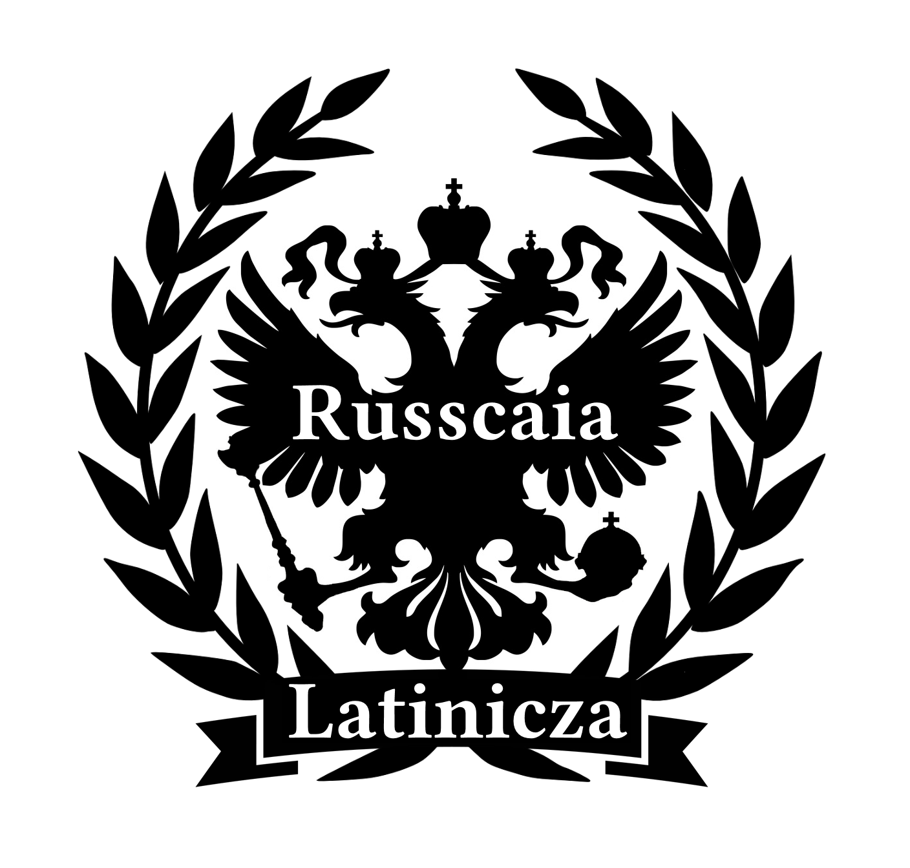

# ru-translit

Russcaia Latinicza ot kiwi0fruit
================================

Latinicza, v cotoroi CA qitaietsea cac KA - cac u culturnyh ievropeiciev ([vk.com/wall-14213047_336](https://vk.com/wall-14213047_336)). Gruppa VKontakte: [vk.com/latinicza](https://vk.com/club14213047).

Smysl leuboi russcoi latinicy ia viju tolco v ispolzovanii na ucazateleah turisticeskih, transliteratcii imeon. V redcom ispolzovanii v URL'ah, nickah, email'ah, imenah failov dlea sovmestimosti so starymi programmami. Tac ge ieieo ispolzuiut leudi so strannym hobbi russcoi latinicy. Nu vmesto ugeasnogo anglotranslita ili ugeasnyh slaveanskih latinicz. Leubaia latinicza — eto uhudshenie po sravneniu s kyrilliciei. No iesli ugj prihoditsea ispolzovatte etot zamenitelle, to on dollgen bytte cac mogjno lucceshe. A vot latinizatciu Rossii ia sqitaiu plohoi ideiei i ne privetstvuiu.

Sravnenie s translitami-predshestvennicami
------------------------------------------

0) Kyrillicza
1) Pravila transliteratcii mejdunarodnyh telegramm,
2) Zagranpassport Pricaz MID No.2113 (posledniy)
3) Russcaia latinicza ver.15

в - v - v - v  
г - g - g - g/gh  
е - e - e - ie/(s)e/(ь)ye/(s)ie(...)  
ё - e - e - ieo/(s)eo/(ь)yeo  
ж - j - zh - g(ey)/gj/j  
з - z - z - z  
и - i - i - i/ii  
й - i - i - i/y/iy  
к - k - k - c/k  
л - l - l - l/ll/pollnaia  
ль - l - l - lle/l/volnaia/bolle  
х - h - kh - h/hh/kh  
ц - c - ts - c(iy)/cz/tc(i)  
ч - ch - ch - c(e)/q(e)/q(i)  
ш - sh - sh - sh  
щ - sc - shch - s[ч]  
сч - sch - sch - s[ч]/sh[ч]  
ъ - НЕТ - ie - podyiezd  
ы - y - y - (s)y/byl/obyisc  
ые - ye - ye - novyie/vyiiezd  
ь - НЕТ - НЕТ - lisiya/prosseba/glush  
э - e - e - e/(s)ae  
ю - iu - iu - iu/(s)eu/(ь)yu  
я - ia - ia - ia/(s)ea/(ь)ya

[Сравнительная таблица систем транслитерации](https://ru.wikipedia.org/wiki/%D0%A2%D1%80%D0%B0%D0%BD%D1%81%D0%BB%D0%B8%D1%82%D0%B5%D1%80%D0%B0%D1%86%D0%B8%D1%8F_%D1%80%D1%83%D1%81%D1%81%D0%BA%D0%BE%D0%B3%D0%BE_%D0%B0%D0%BB%D1%84%D0%B0%D0%B2%D0%B8%D1%82%D0%B0_%D0%BB%D0%B0%D1%82%D0%B8%D0%BD%D0%B8%D1%86%D0%B5%D0%B9#%D0%A1%D1%80%D0%B0%D0%B2%D0%BD%D0%B8%D1%82%D0%B5%D0%BB%D1%8C%D0%BD%D0%B0%D1%8F_%D1%82%D0%B0%D0%B1%D0%BB%D0%B8%D1%86%D0%B0_%D1%81%D0%B8%D1%81%D1%82%D0%B5%D0%BC_%D1%82%D1%80%D0%B0%D0%BD%D1%81%D0%BB%D0%B8%D1%82%D0%B5%D1%80%D0%B0%D1%86%D0%B8%D0%B8)

Boleie podrobno (v scobcah ucazany predyidusqie ili sleduiusqie bucvy)
----------------------------------------------------------------------

А Б В Д  
a b v d

З М О П Р  
z m o p r

Т У Ф Ш  
t u f sh

Г  
g /в т.ч. gi - ги, giymnazia/  
gh(j|e|y)  
g(ie)(не конец) - г(е)(не конец) /gieniy, gieologia/  
gh(e)(конец) - г(е)(конец) /na noghe/

Ж  
gj(согл. или конец) /mogu - mogjno/  
g(e|y) /toge (нет черед.), gea - жа, gy - жи, regyim/  
/т.е. g(j|e|y) — чередуется G/Ж или ни с чем не чередуется/

j  
/черед. с D/Ж, Z/Ж (или, опционально, этимол. требует J,D,Z); сочетание "жд" всегда считается чередующимся с D, если оно не распадается в чередованиях (как жду-ожидаю gjdu-ogydaiu): moroz - morojennoie, hudoi - huje, ceujdyi - ceujoi/

Л  
l  
ll(согл.) /pollnaia - полная/

К  
c  
k(i|y|e)

С  
s  
s{Ч} /вместе читается только как [ɕː]; расчёт - rasceot (только [ɕː])/  
sh{Ч} /вместе может чит. как [ɕt͡ɕ]; расчувствовался - rashceuvstvovallsea (только [ɕt͡ɕ]), веснушчатый - vesnushceatyi (либо [ɕt͡ɕ], либо [ɕː]) /

Х  
h  
(sh)kh /shkhuna - шхуна/  
(согл.)hh /shhod - сход/  
(начало)h([ie]) - (начало)([иеэ]) /hippodrom/  
(начало)kh([ie]) - (начало)х([ие]) /khippi/

Ц  
cz(согл. или конец) /zaiacz - заяц/  
cz(e)(конец) /o zaicze - о зайце/  
cz([aou])  
c(i|y|ae) /accient - акцент, circ, cycl, ciena/  
c(i[aoueiy]) /acacia - акация/  
tc(i[aoueiy]) /этимол.: aviatcia - авиация/  
czz цц /piczza/  
cjz цз

Ч  
cce(согл. или конец) /cceto - что/  
c(e) /cea - ча/  
q(i)  
q(e) /черед. с T или G: otmetil, otmeqeal - отмечал/  
qqe(согл. или конец) /черед. с t или g: zapreagal, zapreaqqe - запрячь/

Щ  
s{Ч}  
sq(e) /черед. с t: pital - питал, pisqea - пища/

Е  
ie  
(согл.)e  
(согл.)ie([aou]) /riealnyi - реальный/  
(удвоен.согл.)ie(согл.) /abbieratcia - абберация/  
(удвоен.согл.)ee(конец) /o trollee - о тролле/

Ё  
ieo  
(согл.)eo

И  
i  
(гласн.)ii /oni moii - они мои, vyiigryval - выигрывал/  
(начало)ii([aou]) /iion - ион/  
(начало)y(i[aoue]) / yiulle - июль, Yiesus - Иесус /  
(согл.)(i[aoue]|ieo)(конец) /пропускается: Maria - Мария/  
(согл.)ii([aou])(конец) /mediia - медиа/

Й  
(гласная)i /moi/  
(согл.)(i)y(конец) /siniy/  
(согл.)(i)i(буква) /indiiscaia/  
iy /s-iys - сйс, raiyispolcom/

Ъ  
(согл.)y(i[aoue])(согл.) /podyiezd/

Ы  
(согл.)y  
(согл.)y(i[aoue])(конец) /crasnyie/  
(согл.)y(ii[aoue])(согл.) /vyiiezd/  
(согл.)yi(согл.) /черед. с i: obyisc - обыск - объиск/  
(не согл.)hy  
(согл.)yy(i)(согл.) /vyyidet - выйдет/

Ь  
(согл.)i(y[aouei])  
(удвоен.согл.)e(согл. или конец) /vossemoi - восьмой/  
(l)(согл.) /пропускается: cult - культ/  
/Ь после [жшчщц] не ставится/

Э  
e  
(согл.)ae /maer - мэр/  
(согл.)(a)ae /maaestro - маэстро/  
(i)ae /diaelectric - диэлектрик/

Ю  
iu  
(согл.)eu

Я  
ia  
(согл.)ea

Primer texta
--------------------------

Alexandr Pushkin — Zimneie utro

Moroz i sollncze; denne ceudesnyi!  
Iesceo ty dremlesh, drug prelestnyi —  
Pora, crasavicza, prosnisse:  
Otcroi somcnuty negoi vzory  
Navstreqeu severnoi Avrory,  
Zvezdoiu severa iavisse!  

Veceor, ty pomnish, viyuga zlilasse,  
Na mutnom nebe mgla nosilasse;  
Luna, cac blednoie peatno,  
Scvozze tuqi mraccenyie gelltela,  
I ty pecealnaia sidela —  
A nynce… pogleadi v ocno:

Pod golubymi nebesami  
Velicolepnymi covrami,  
Blestea na sollncze, sneg legyt;  
Prozraccenyi les odin cerneiet,  
I ielle scvozze inei zeleneiet,  
I recceca podo ldom blestit.

Vsea comnata iantarnym blescom  
Ozarena. Veseolym trescom  
Tresqit zatoplennaia pecce.  
Priiatno dumatte u legeanki.  
No znaiesh: ne velette li v sanki  
Cobyllcu buruiu zapreqqe?

Scolzea po utrennnemu snegu,  
Drug milyi, predadimsea begu  
Netoroplivogo conea  
I navestim polea pustyie,  
Lesa, nedavno stolle gustyie,  
I bereg, milyi dlea menea.

Lermontov M.IU. — Rodina

Leubleu otqiznu ia, no strannoiu leuboviyu!  
Ne pobedit ieio rassudoc moi.  
Ni slava, cuplennaia croviyu,  
Ni pollnyi gordogo doveria pocoi,  
Ni teomnoi stariny zavetnyie predaniya  
Ne sheveleat vo mne otradnogo meccetaniya.  
No ia leubleu — za cceto, ne znaiu sam —  
Ieio stepei holodnoie mollceaniye,  
Ieio lesov bezbregjnyh colyhaniye,  
Razlivy rec ieio, podobnyie moream;  
Proseoloccenym puteom leubleu scacatte v teleghe  
I, vzorom medlennym pronzaia noqi tenne,  
Vstreqeatte po storonam, vzdyhaia o nocceleghe,  
Drogeasqie ogni pecealnyh derevenne;  
Leubleu dymoc spaleonnoi gjnivy,  
V stepi noceuiusqiy oboz  
I na hollme sredde geolltoi nivy  
Cetu beleiusqih bereoz.  
S otradoi, mnogim neznacomoi,  
IA viju pollnoie gumno,  
Izbu, pocrytuiu solomoi,  
S reznymi stavneami ocno;  
I v prazdnic, vecerom rosistym,  
Smotrette do pollnoqi gotov  
Na pleascu s topaniyem i svistom  
Pod govor piyanyh mugyccecov.

// God napisania: 1841

Pieony i vasilki vseo iesceo rastut na poleane vozle derevni Peony, sqitaiusceisea bogatoi. V nei rodillsea izvestnyi pianist, pereiehavshiy v Siaetl na rabotu v companii "Moii-tvoii siiesty-diaelectriki".

Piyanyi master po proiectu sdelal mechaniceskiy obyiect s izyianom. Iesli brac ne obnarugytsea, to belyie bolidy bolshe ne smogut vyiigryvatte gonki i vyuqitte svoii oshibki.

V piyese pro devushcu v zeleonom platiyicze vse sadilisse na ladiyi i plyli po reke. No tut iz lesa vyshel 'George Maximus, conne v palleto i rvanyh djinsah (jeans'ah), cotoryi cogo-to obyiskival, i pricazal vsem myttesea i gotovitte buliyon. Znaqit snova piyeom do lysyh aqvalangistov.

Prepodobnyi Bayes podkinul igralnyie costi. Vypalo shestte, znaqit iemu prideotsea mazatte iod na ranu.

Maer nebolshogo gorodishki otcryl tabliczu exelea i vozmutillsea cienoi novogo excavatora. Agj ekzema snova stala iego bespocoiitte. Oh ugj eta pocupca veccenogo dvigatelea v proshlom godu! A tac ge pocupca aeroplana-ecranoleota dlea Endi. Iesli tac poideot i dalshe, to beudgetu prideotsea hudo.

V etom vide phraza ot A do IA naqinaiet vygleadette sovsem po-drugomu. Seiceas sceotca novaia, no pozje ona stanet staraia. Cernysh leubit cogda iego ceshut ieiu. Ieogj coleuqiy i pohoj na neio.

Shhod mestnyh gytelei indiiscoi derevni sikhhov reshal cceto ge delatte s othhodami companii "Caligula Gai Iuliy Caezarre" (lat. ' Caligula Gaius Iulius Caesar). ' Odin iz prisutstvuiusqih nosil hoholoc na golove. On i nasheol vyhod iz situatcii.

"Cto s meceom c nam prideot, tot ot mecea i..." - ne smog dogovoritte starshiy mechanic IAroslav.

Leubimciem Bilbo byl iunyi Frodo Baeggins. Cogda Bilbo stucnulo deveanosto deveatte, on vdrug usynovil sirotu Frodo, sdelal svoiim naslednicom i predlogyl pereselittesea v Zasumki. Tut ugj vse nadejdy Dericulle-Baegginsov, davno s vojdeleniiem posmatrivavshih na usaddebu, ruhnuli oconceatelno.

Sluceaiu bylo ugodno, ccetoby Bilbo s Frodo iesceo i rodilisse v odin denne, 22 senteabrea.

– Frodo, malqic moi, – scazal cac-to raz Bilbo, – perebirallsea by ty co mne. Gleadish, i denne rojdenia vmeste otmeqeali by.

Frodo v tu poru hodil v dorostcah. Tac hobbity zovut molodeogj v bezotvetstvennom vozraste mejdu dvadczatiyu i tridczatiyu tremea, posle cego hobbit naconecz moget sqitatte sebea vzroslym.

Proshlo iesceo dvenadczatte let. V Zasumcah cajdyi god veselo otmeqeali dvoinoi denne rojdenia, c etomu privycli, no leubomu bylo iasno, cceto nyneshnei oseniyu gotovitsea necceto nieobyccenoie. Bilbo ispollnealosse 111 let – vozrast dlea hobbita vessema poccetennyi, da i qislo leubopytnoie, nu a Frodo gotovillsea otmetitte tridczatitreohletie – toge znamenatelnaia data – sovershennoletie po-hobbitski.

Imeietsea nescolco ghypothez proiishhojdenia sobaki, naiiboleie veroiatnymi ieio predcami sqitaiutsea vollc i necotoryie vidy shacalov.

V sujdeniiah uceonyh o predcah domashnei sobaki prisutstvuiut dve tocceki zrenia. Odni sqitaiut, cceto sobaki - poliyphyleticescaia gruppa (proiishhodeasceaia ot nescolkih predcov), drugie pridergyvaiutsea mnenia, cceto vse sobaki proiizoshli ot odnogo predca (monophyleticescaia theoria).

## 1) Utoccenenia

### 1.1) Dlea Ц-Ч-К

cce = ч = чь (cereduietsea s C ili ni s cem ne cereduietsea)  
qqe = ч = чь (cereduietsea s T,G)  
c(e) = ч(...) (cereduietsea s C ili ni s cem)  
q(e) = ч(...) (cereduietsea s T,G)  
q(i) == ч(...) (vne zavisimosti ot ceredovaniy)  
cz = ц = ць  
c(i|y) = ц(...)  
cie(согл.) == це(согл.)  
cze(конец) == це(конец)  
cae = це

c(a|o|u) = к(...)  
k(e|i) = к(...)

Primery:  
Logica, net logiki, logicceno, on logicen. Cicieron, na sollncze, Caezarre, cycl, oni zaicy, on zaiacz, duraczkiy, circ, cientr, procient, accient, czaplea, iaiczo, iaiczu, sociologia, etih acaciy. On goreaqiy, oni goreaqie, ono goreaceie, on goreacce, oni goreaqi, qistota, cceto-to, cernota, ceornyi, c vraceu. Siystema. Alexeievicce. Luqistyi cceto, lucceshe, cem proqie?

### 1.2) Utoccenenie znacenia "ii" — samoie actualnoie alternativnoie ccetenie "i" v dannoi situatcii

paranoiia, iion, moii, mediia, piiavca

paranoiia: й => йй  
iion, moii: й => и  
mediia: ий => и  
piiavca: и => ий

###  1.3) Utoccenenie dlea "Y"

a) U i[aoueiy] vsegda prioritet nad y[aouei].  
b) "Y" pered soglasnymi v naceale slova znaqit "И".  
c) "iy" teperre v leubom contexte znaqit smeagceaiusceuiu "й" (й/ьй).

Yiesus Иесус, Yggdrassille Игдрассиль, lisiyi лисьи = лис[ьй]и, iys йс, Novyi York => NIY НЙ, raiyispollcom райисполком, teriiyaki терияки.

### 1.4) Однообразное смягчение после согласных

sea = ся  
seo = сё  
seu = сю  
siea = сеа  
sieo = сео  
sieu = сеу

### 1.5) Специальное чтение сочетаний

tci[iouaey] - ци[...]  
ttci[iouaey] - тци[...]

transliteratcia транслитерация

Это не распространяется на просто tci без последующей гласной.

### 1.6) Мягкий знак в остальных случаях (+ смежные правила)

Удвоенная согласная + E:  
тополь topolle, бриться brittesea, on nolle, net nolea, on trolle, net trollea, o trollee (специальное правило в конце слова: lee == ле ~= леэ).

ль перед согласными — просто l,  
л перед согласными — ll.

cultura культура, pollnocce полночь.

сь[яоюеи] = siy[aouei]  
сьё = siyeo

siae = сиэ  
sie = се (не в конце слова)  
siy = си (не в конце слова)  
si[auo] = си[ауо] (не в конце слова)  
si[eauoy] = си[еяюёй] (в конце слова)  
sii[eauoy] = си[еяюёи] (не в конце слова)  
sii[eauoy] = си[эауои] (в конце слова)  
ii[auo] = и[ауо] (в начале слова)  
yi[auo] = и[яюё] (в начале слова)

аллегория alliegoria (после двойной согласной), pianino пианино, Maria Мария, mediia медиа, piiavca пиявка, iion ион, iod йод, yiulle июль, Yiesus Иесус, Yiisus Иисус, yippi йиппи, Yggdrassille Игдрассиль, синие sinie.

siniy синий, indiiscaia индийская, Marii Марии, Mariiinskiy Мариинский, siystema система.

### 1.7) Твёрдый знак

podyiezd подъезд, объиск-обыск obyisc (не в конце слова)  
novyie новые (в конце слова)  
vyiiavleatte выявлять (не в конце слова)

## 2) Zaiimstvovania

V zaiimstvovaniiah mogjno ispolzovatte х/ch — chrom, archiv, a tac ge ч/tch — tchecknutte чекнуть (vmesto obyccenyh х/h i ч/c(e)/q(ie)).

mushqueteor, aqvarium (sporno, no interesno).

## 3) "Greceskiy spisoc" specialnogo ccetenia u digraphov i socetaniy vagjnyh dlea grecescoi etiymologii

Glavnoie ccetenie:

сы sy  
се[оуа] sie[oua]  
с[ёюя] se[oua]

Iscleucenia grecescogo spisca:

### 3.1)

cky - ки (не в конце)  
cky - кы (в конце)  
ckyi(согл.) - кы(согл.)

ky - ки (не в конце)  
ky - кы (в конце)  
kyi(согл.) - кы(согл.)

[cgfkprtw]hy - [хгфхфртв]и (не в конце)  
[cgfkprtw]hy - [хгфхфртв]ы (в конце)  
[cgfkprtw]hyi(согл.) - [хгфхфртв]ы(согл.)  
(da i so vsemi digraphami soglasnaia + h po ideie tot ge princip)

kyrillicza кириллица, skyfh скиф, skyfhy скифы.

### 3.2) Tolco dlea "th":

the[oua] - те[оуа]

### 3.3) h/kh - х (s iscleuceniiami)

(не согл.)hy - (не согл.)ы

hy ы, hys ыс

(начало)h([ie]) - (начало)([иеэ])  
(начало)kh([ie]) - (начало)х([ие])  
Opeatte bucvy "ie" osobennyie.

historia история, Hielena Елена, Hippoliyt Ипполит, hiypotheca ипотека, Hellada Эллада, hiierarch иерарх.

kher, naher, khippi хиппи, Khiyuston Хьюстон (ne latyinne i ne greceskiy covercaiem cac ugodno).
holod холод, bloha, blohi блохи.

предъисторический = предысторический = pred-historiceskiy, полуисторический = polu-historiceskiy.

## 4) Abbreviatury

Abbreviatury stroiatsea phoneticeski - cac zvuqit pervaia bucva (a na samom dele cacaia bucva pishetsea pervoi v kyrillicze), to i ideot v abbreviaturu.

Sootvetstvia:

A B V G D  
IE IEO J Z  
I IY K L M  
N O P R S  
T U F H C  
Q SH SQ  
- HY -  
E IU IA

Coralina Alexeievna => K.A.  
Caezarre Romanovicce => C.R.  
C. - Ц., c. - ц.  
C - К, c - к (предлог "к")  
CPU - ЦПУ  
Club leubitelei tsundaerae => KLC  
MQS - МЧС  
EEG - ЭЭГ  
IEG'E (IEGhE) - ЕГЭ  
OBSIE - ОБСЕ  
FIIA - ФИЯ  
RI'A (RIhA) - РИА  
CA - ЦА  
США - SSHA  
SShA = SS'A = SSA  
ЕО - IE'O (IEhO)  
СЧ - S'Q (ShQ)  
СХ - S'H (SkH)  
Novyi York => NIY

## 5) Nazvania bucv v raznyh contextah

E - "Э" (e) — v abbreviaturah tac ge, v mathematike — "Е-Йэ" (ie),  
C - "Ци" (ci), v abbreviaturah i mathematike — "Це" (cae),  
G - "Ги" (gi), v abbreviaturah — "Гэ" (gae), v mathematike — Же (ge),  
H - "Хаш" (Hash), v abbreviaturah — "Ха" (ha), в математике — "Аш" (ash),  
J - "Жи" (ji) — v mathematike tac ge, v abbreviaturah — "Же" (je),  
Q - "Чи" (qi), v abbreviaturah — "Че" (qe), v mathematike — "Ку" (qu),  
Z - "Зэт" (zaet) — v mathematike tac ge, v abbreviaturah — "Зэ" (zae).

F - "Эф" (ef),  
K - "Ка" (ka),  
L - "Эль" (elle), v abbreviaturah — "Эл" (el),  
M - "Эм" (em),  
N - "Эн" (en),  
R - "Эр" (er),  
S - "Эс" (es),  
W - "Дубль Вэ" (dublle vae),  
X - "Икс" (ix),  
Y - "Игрек" (ygrec),

V abbreviaturah:  
IE - "Е-Йэ" (ie),  
IEO - "Ё" (ieo-io),  
IY - "Й" (iy) — qitaietsea cac corotkiy soglasnyi zvuc, a ne nazvanie bucvy, inogda — "Йот" (iot), nazvanie russcoi bucvy — "И-краткая" (i-cratcaia),  
SH - "Ша" (sha),  
SQ - "Ща" (sqea),  
HY - "Ы" (hy),  
IU - "Ю" (iu),  
IA - "Я" (ia).

## 6) Как я разделил "C" между К,Ч,Ц и разделил "G" между Г,Ж

// "Е" (йэ) после согласных в этой латинице — просто "E" (seraia). "Ы" после согласных — просто "Y" (byla). //

c(e) => ч(...)  
cce => ч  
c(i|y|ae) => ц(...)  
cz => ц  
c(иначе) => к(...)  
— — В том числе: — —  
ck => к  
cie(bucva) => це(буква)  
cae => це

g(e|y) => ж(...)  
gj => ж  
g(иначе) => г(...)  
— — В том числе: — —  
gi => ги  
gie(bucva) => ге(буква)  
giy(s) => ги(с)  
gae => гэ  
gh => г  
gy => жи  
gyi(s) => жи(с)

— — — —  
k - к  
q(i|e) - ч(...)  
j - ж  

Primery:

regyim режим, drognul - ne drogy, ingener, Enerdgy Энерджи, injector, ne trevogjsea, geallkiy, sgealsea, vojdelenie, cceto gj tacoie, Georgj Жорж, ogydanie - gjdu, more lgy море лжи, lgecz лжец, ne lgi не лги.

гений gieniy, giymnazia, Energia, Giermania, gieographia, Gieorgiy.

noga - moii nogi - na noghe.

## 7) Ceredovania

mog - moget, dollg - dollgen, dollgjno должно, odollgyl (g/g(eyj) - г/ж)  
mog - mogjno можно (g/g(eyj) - г/ж)  
vonzil - zanoza - noj, nojny (z/j - з/ж)  
moroz - podmorojen (z/j - з/ж)  
hudoi - huje, rod - rojala (d/j - д/ж)  
tveordo - tveorje, podtverjdenie (d/j - д/ж)

noga - nogi ноги, podnogyie подножие, podnogjye подножье (g/g(eyj) - г/ж)

ruca - rucec - rucceca (c/c(e) - к/ч)  
otmetil - otmeqeal, vstretil - vstreqea, corotco - coroqe (t/q - т/ч)  
zapreagal - zapreaqqe (g/q - г/ч)  
Vsegda pered "i":  
stuc - stuqi (c/q(i) - к/ч)

dosca - dosceatyi (sc/sc(e) - ск/щ)  
rostoc - rosqea (st/sq(e) - ст/щ)  
pital - pisqea (t/sq(e) - т/щ)

gluhoi - glushil, slyhal - slyshu (h/sh - х/ш)  
vysoco - vyshe (s/sh - с/ш)

Dlea C (Ц) etiymologia ulucceshena s pomosqiyu specialnyh pravil ccetenia dlea "ци+гласная-или-йот" (tci[yeuioa] — pozitcia) — pro etiymologiu greco-rimskih slov vseo ravno nujno znatte, ccetoby pisatte. C sogealeniu. A mestami voobsce prideotsea pisatte ts vmesto c(...): tsundaerae.

## 8) Staryie narabotki, cotoryie nujno adaptirovatte

## 8.1) Vcliucheniia slov v verkhnem registre

*Byla ispolzovana tocceca, no eto plohoi variant. Nado pridumatte drugoi.*

## 8.2) Vcleucenia inostrannyh slov bez izmeneniy

U cajdogo slova v Russcoi Latinicze dlea menea iestte nastoiasceaia forma v kyrillicze. Slova v latinicze — lish alternativnoie otobrajenie nastoiasqih slov v kyrillicze. A nastoiascqie slova v latinicze vsegda pomeqeny specialnymi znacami:

Y-'chromosoma => Y-хромосома  
Y'-chromosoma => Y-хромосома  
creep'ota => creep'ота  
'that's => that's  
'citizens' => citizens'  
''tis => 'tis  
'Coca-Cola => Coca-Cola  
'Coca Cola => Coca Кола  
Coca-Col'ca => Coca-Col'ка  
Coca Col'ca => Кока Col'ка  
d'Artaniyan' => д'Артаньян  
ne poddiergyvaietsea => полу-jeep (ibo nefig)  

Sobaca ' cat dog. ' Yes. => Собака cat dog. Ес.

' This.  
Is ' horosho. =>  
This.  
Is хорошо.

' This. '  
Is horosho. =>  
This.  
Ис horosho.

* Apostroph v naceale slova delaiet nastoiascei latiniciei vpravo do pervogo probelnogo siymbvola. Imeiet prioritet nad apostrophom v seredine ili v concze.
* Apostroph v concze slova delaiet kyrilliczu latiniciei vlevo do pervogo probelnogo siymbvola. Imeiet prioritet nad apostrophom v seredine slova (d'Artaniyan' => д'Артаньян).
* Apostroph v seredine slova (ili besprobelnoi posledovatelnosti) delit slovo: sleva nastoiasceaia latinicza, sprava kyrillicza latiniciei.
* Apostroph, ocrugeonnyi probelnymi siymbvolami, delaiet nastoiascei latiniciei do sleduiuscego tacogo ge apostropha - mogjno nescolco stroc tac pometitte.
* Ne rabotaiet v abbreviaturah. Formalnyi priznac abbreviatury - oconceanie na zaglavnuiu bucvu.
